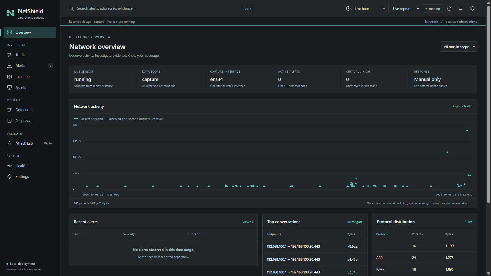
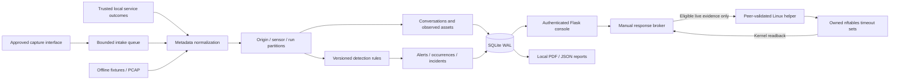
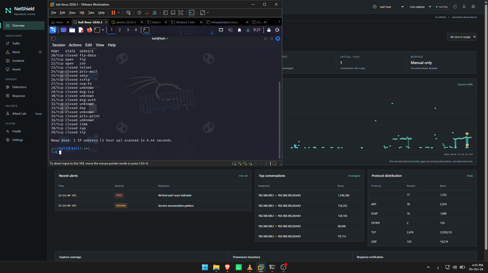
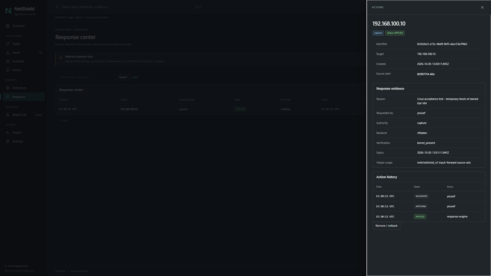
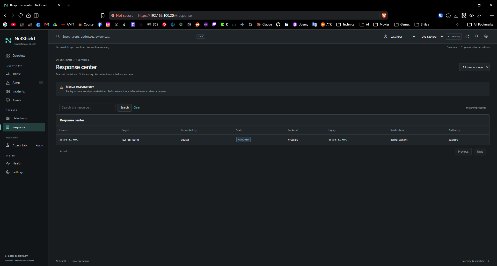
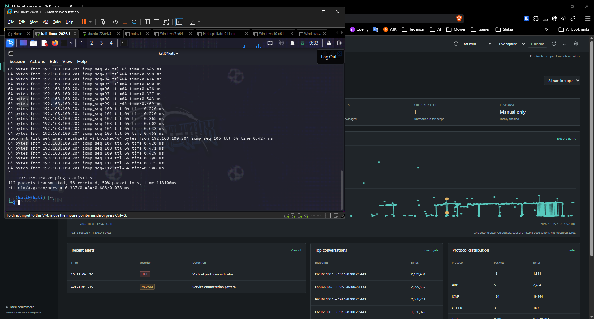
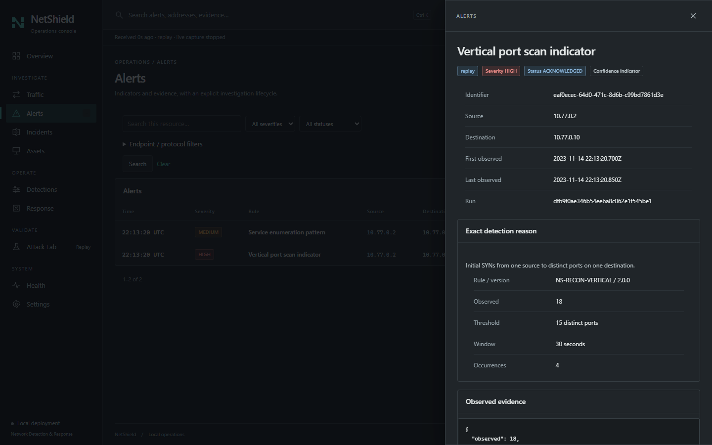
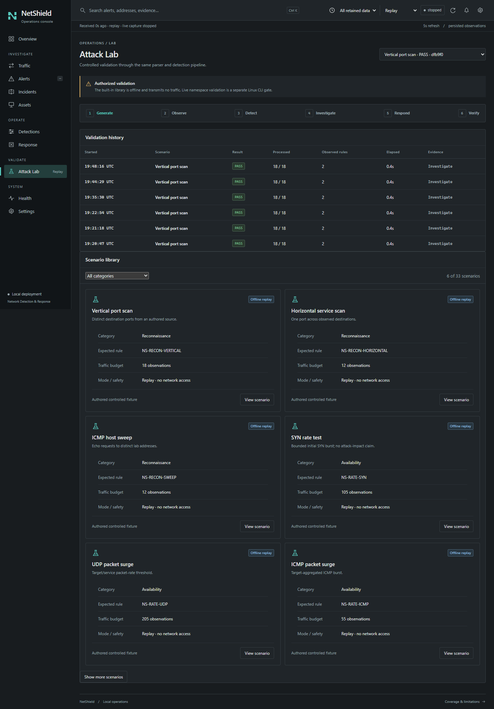

# NetShield

**Network Detection & Response for an observable, reproducible home SOC.**

NetShield connects network observations to explainable detections, analyst investigations and bounded response. Its authenticated operations console brings together conversations, alerts, incidents, observed assets and evidence timelines. A controlled Attack Lab validates the same detection pipeline without sending traffic to external targets.

A compact single-host Python appliance with portable offline replay, optional Linux capture and manual nftables response.

**Observe → Detect → Investigate → Respond → Verify**



*Actual operator-provided Linux acceptance screenshot: live capture on `ens34`. Sensor health is reported independently of alert count.*

[Install](#installation) · [Safe demo](#safe-offline-demo) · [Linux acceptance](#tested-linux-acceptance) · [Detections](docs/DETECTIONS.md) · [Security](#security-model)

## Why NetShield exists

A useful security console must explain what happened, why a rule fired, what evidence supports it, and whether a response actually took effect. NetShield makes that path inspectable and repeatable. Detection outputs are indicators with possible benign explanations; zero alerts are never presented as proof that a network is secure.

## Key features

| Capability | What it does |
|---|---|
| Network visibility | IPv4/IPv6 TCP, UDP, ICMP, ARP and VLAN metadata; bidirectional conversations, observed addresses, protocol statistics and one-second packet/byte buckets |
| Explainable detections | 25 versioned deterministic indicators with rule IDs, windows, observed values, thresholds, confidence and evidence requirements |
| Analyst investigations | Durable alerts and occurrences, correlated incidents, notes, status changes, related flows and evidence timelines |
| Operations console | Overview, Traffic, Alerts, Incidents, Assets, Detections, Response, Attack Lab, Health and Settings; shared origin/time/run filters and responsive tables |
| Controlled validation | 33 authored offline scenarios evaluated by the real parser/rules, bounded local PCAP import and expected-versus-observed results |
| Manual response | Optional Linux nftables helper, protected infrastructure, explicit scope, finite block expiry, action history, rollback and kernel readback |
| Evidence and lifecycle | Local incident PDF/JSON exports, audit history, metadata retention, schema migrations and verified SQLite backups |
| Authenticated management | Local operator bootstrap, scrypt passwords, server-side sessions, CSRF protection and viewer/operator/admin roles |

Reconnaissance, rate anomalies, authentication outcomes, DNS, layer-2 changes and outbound behavior are covered in the [detection catalogue](docs/DETECTIONS.md). Password-failure detections require trusted service outcomes; connection counts alone do not prove failed logins.

## Architecture



Capture, management, maintenance and privileged response run as separate processes. Metadata and detection state are bounded; intake overflow and coverage degradation remain visible. The browser uses local CSS, SVG and native JavaScript modules with authenticated polling. No cloud service, frontend build or CDN is required.

[Architecture and data boundaries](docs/ARCHITECTURE.md) · [API](docs/API.md) · [Configuration](docs/CONFIGURATION.md)

## Screenshots

These screenshots are from the operator's owned Ubuntu/Kali VMware lab. They show real observations and manual response, not seeded successful enforcement.

| Detection and investigation | Verified response lifecycle |
|---|---|
|  |  |
| Scan activity produces vertical-scan and enumeration indicators. | The drawer shows requester, evidence, finite expiry and `kernel_present`. |

<details>
<summary>Expiry, connectivity evidence and offline investigation screens</summary>





The following two screens show **actual authored offline replay**, separate from live Linux evidence:





</details>

All six supplied Linux screenshots are preserved unchanged under [docs/assets/linux-acceptance](docs/assets/linux-acceptance), with an [evidence manifest](docs/assets/linux-acceptance/evidence-manifest.json). [Linux acceptance](docs/LINUX-ACCEPTANCE.md) distinguishes screenshot-visible and operator-reported results.

## Installation

For a new, dedicated, operator-owned **Ubuntu 22.04 or 24.04 systemd VM**, with root/sudo and package network access:

```sh
git clone https://github.com/YousefE1bana/Net-Shield.git
cd Net-Shield
sudo ./install.sh
```

The installer asks for the capture interface, local management IP, allowed management client IP/CIDR and sensor identifier. It builds a wheel, creates a service account and private state directory, generates systemd units and configures a dedicated selected-IP Nginx HTTPS listener. Operator passwords use an interactive prompt; there is no default password.

**Default: observe-only.** Automatic response is unsupported. The host helper requires explicit opt-in and private response scope; installation does not generate a scan or block a host. The generated self-signed certificate requires deliberate client trust, or you can supply your own certificate/key.

```sh
./install.sh --help
sudo ./install.sh --dry-run       # Read-only discovery and plan
sudo ./install.sh --verify-only   # Read-only managed-deployment checks
```

Python **3.11+** is required. Ubuntu 22.04's system Python 3.10 is insufficient: provide a supported interpreter, or explicitly approve the optional third-party Python PPA. Ubuntu 24.04 is an installation target, not a completed runtime acceptance claim.

**Installer status:** portable contract tests and packaging checks pass; the new `install.sh` first-install/rerun/failure lifecycle has not yet been executed on Linux. The controlled manual Linux runtime acceptance below is separate. Use a fresh owned VM for installer evaluation. Existing manual deployments without the ownership ledger are refused rather than adopted.

[Complete installer guide](docs/LINUX-INSTALL.md) · [Portable installation, backup and recovery](docs/INSTALL.md)

## Safe offline demo

Replay works on Windows or Linux without capture or firewall privileges. From the cloned repository:

```sh
python -m venv .venv
source .venv/bin/activate           # Windows: .venv\Scripts\Activate.ps1
python -m pip install .
python -m netshield init
python -m netshield operator-add analyst
python -m netshield replay port-scan
python -m netshield serve
```

Open `http://127.0.0.1:8080`, sign in, select **Replay**, then choose the vertical port-scan run. Recorded event timestamps are retained; replay time ranges anchor to recorded observations. Capture remains stopped until separately configured and started.

```sh
python -m netshield replay --all
python scripts/replay_demo.py --data data --output reports/demo-1
```

The second command creates a complete investigation: replay observations → alerts → incident → analyst notes → manual **dry-run** response → resolution → PDF/JSON export. Use a new output directory. It transmits no packets and never claims kernel enforcement.

[Scenario walkthroughs](docs/DEMO-SCENARIOS.md) · [Actual replay report](docs/assets/v2-final/flagship-replay.pdf) · [Attack Lab safety](docs/ATTACK-LAB.md)

## Usage

1. **Observe:** check capture state, freshness and coverage in Overview and Health; choose live/replay/run/time scope.
2. **Investigate:** pivot from Traffic or Alerts into rule evidence, observed values, related conversations and incident timelines. Record notes and analyst status.
3. **Tune:** use scoped, expiring detection exceptions for reviewed false positives. Response protections are separate.
4. **Respond:** when locally enabled, review eligible live evidence and request a reasoned, finite manual block. Inspect kernel verification and history; remove it or let the timeout expire. Replay remains dry-run only.
5. **Verify and retain:** inspect removal/readback, resolve the investigation and export a report. Back up private data before upgrades.

Trusted local sshd journal and root-owned web outcome adapters require separate deliberate configuration. Browser Attack Lab execution is offline-only. The optional CLI Linux namespace validation requires explicit ownership authorization on a dedicated VM; it has no arbitrary internet target or command input.

## Security model

- **Management is unprivileged.** Waitress binds loopback; the Linux installer adds a selected-IP TLS proxy and explicit client ACL.
- **Privilege is separated.** Capture has `CAP_NET_RAW`; the optional helper has `CAP_NET_ADMIN` and `CAP_CHOWN`. Root-owned code/configuration and isolated Python imports prevent writable data from supplying privileged modules.
- **Response requires evidence and scope.** Unix peer validation, protected infrastructure, manual analyst intent, finite TTL and owned table/schema validation precede enforcement. Applied/removed states require kernel readback.
- **Replay cannot gain live authority.** Origin/run partitions are assigned at ingress. Replay and isolated-lab evidence cannot authorize the host helper.
- **Metadata stays local.** Private SQLite state, credentials, logs, captures, TLS keys and temporary QA artifacts are excluded from Git. Review exports before sharing.

Use only networks and artifacts you own or are explicitly authorized to monitor/test. NetShield does not reset an existing firewall or offer a generic attack launcher.

[Threat model](docs/THREAT-MODEL.md) · [Response boundary](docs/RESPONSE.md) · [Vulnerability reporting](SECURITY.md)

## Tested Linux acceptance

The operator supplied results from an owned **Ubuntu 22.04.5 LTS / Python 3.12.15 / nftables 1.0.2** VMware lab on 2026-10-05. These were not rerun on the Windows publication workstation.

| Check | Accepted result |
|---|---|
| VM portable suite | 104 passed, 1 skipped on the accepted historical VM copy |
| Owned namespace closed loop | PASS: scan → detection → namespace response → expiry → restored connectivity |
| Cross-VM scan | HIGH `NS-RECON-VERTICAL` and enumeration indicator; reported observed 18 versus threshold 15 over 30 seconds |
| Manual host block | `APPLIED / kernel_present`; owned Kali target; 60-second TTL |
| Packet-path effect | Reported nft counter: 56 packets / 4704 bytes dropped; screenshot: 112 ping packets sent / 56 received |
| Expiry and reconciliation | Owned set empty after timeout; `REMOVED / kernel_absent`; restored connectivity reported |
| Maintenance and management isolation | Timer active, maintenance success; Windows management allowed, Kali HTTP 403 |
| Helper privilege boundary | Student socket access and root peer denied; configured service peer allowed |

[Full evidence and limitations](docs/LINUX-ACCEPTANCE.md). Controlled lab acceptance does not establish universal firewall compatibility, installer acceptance or enterprise certification.

## Quality checks

The publication workstation's Python 3.14.6 suite passes **122 tests, with 1 explicit privileged Linux test skipped**. Ruff, native JavaScript syntax, shell checks, a clean wheel build and installed-wheel replay are verified separately. [Publication verification record](docs/PUBLICATION.md).

```sh
python -m pip install -r requirements-dev.txt
python -m pytest -q
python -m ruff check netshield scripts tests/test_*.py dashboard/app.py setup.py
python -m ruff format --check netshield scripts tests/test_*.py dashboard/app.py setup.py
node --check dashboard/static/js/v2-console.mjs
bash -n install.sh
shellcheck install.sh
python scripts/publication_check.py
```

The [offline CI workflow](.github/workflows/quality.yml) targets Python 3.11–3.14 on Linux and 3.14 on Windows. Privileged namespace/firewall tests are intentionally absent from hosted CI. [Browser verification](tests/ui/README.md) covers the ten-screen console and narrow-phone layouts.

## Limitations

NetShield targets a small monitored environment. Single-host SQLite and Python metadata processing are not advertised as wire-rate capture. Kernel packet loss is unknown; interface placement determines visibility on a switched network. An endpoint sensor does not see every host's traffic.

There is no TCP stream reassembly, encrypted DNS/TLS content inspection, process attribution, remote-agent fleet, automatic blocking or signed forensic chain of custody. Bounded behavioral baselines reset on consumer restart/eviction. Metadata indicators do not prove compromise or authenticated sessions. [Benchmarks](docs/BENCHMARKS.md) distinguish offline processing from live capture capacity.

The new installer still needs first-install, rerun and failure-path acceptance on fresh owned Ubuntu VMs. It preserves data and previous runtimes but does not provide transactional OS/schema rollback. Self-signed certificate renewal and trust are operator responsibilities.

## Tech stack

| Layer | Technology |
|---|---|
| Runtime and management | Python 3.11+, Flask, Werkzeug, Waitress |
| Capture and parsing | Scapy; bounded metadata pipeline |
| Persistence | SQLite WAL, indexed V2 records and migrations |
| Console | Native HTML/CSS/ES modules, local SVG icons and geometric N identity |
| Reports | ReportLab; local JSON/PDF exports |
| Linux deployment | systemd, Nginx, OpenSSL, iproute2, optional nftables helper |
| Verification | pytest, Ruff, Playwright development tooling, GitHub Actions |

Runtime and development dependencies are pinned in [requirements.txt](requirements.txt) and [requirements-dev.txt](requirements-dev.txt). [Dependency license inventory](docs/DEPENDENCIES.md).

## Project structure

```text
Net-Shield/
├── netshield/          # Ingestion, detections, durable evidence, auth, response, CLI
├── dashboard/          # Supported console, templates, local CSS/JS/SVG
├── deploy/             # Least-privilege Linux unit and policy templates
├── scripts/            # Installer, safe replay demo, benchmarks, publication audit
├── tests/              # Portable contracts, authored PCAP, browser QA, opt-in Linux test
├── docs/               # Architecture, rules, scenarios, threat model and evidence
│   └── assets/         # Real screenshots and curated offline example reports
├── .github/            # Offline CI and issue/PR templates
├── install.sh          # Canonical Ubuntu deployment entry point
├── config.example.json # Observe-only example, no credentials
├── pyproject.toml      # Wheel metadata and CLI entry point
└── LICENSE             # Apache-2.0
```

Historical audit and design documents explain the project's evolution; their phase-specific constraints are historical, not current deployment instructions. Private V1 artifacts remain outside the public source inventory.

## Contributing and license

Read [CONTRIBUTING.md](CONTRIBUTING.md) for evidence requirements and safe development. Keep new detections explainable, validation reproducible and response authority narrow. [CHANGELOG.md](CHANGELOG.md) records the current `2.0.0rc1` candidate.

NetShield source is licensed under [Apache-2.0](LICENSE). Dependencies retain their own licenses; see the [license decision](docs/LICENSE-DECISION.md) and [dependency inventory](docs/DEPENDENCIES.md).
