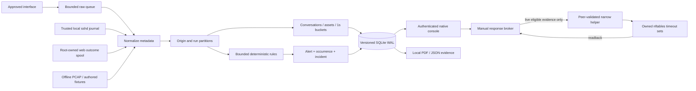

# NetShield V2 architecture

Python/Flask/SQLite/Scapy remain. Native HTML/CSS/ES modules preserve the approved graphite/teal console and geometric N mark. Waitress serves authenticated loopback management. Capture, trusted service ingestion and root response are explicit separate CLI processes.

Raw callback: counters and `put_nowait` only. Consumer: at most 32 packets per durable transaction, normalization/analysis/persistence outside capture callback. Queue overflow is counted and produces coverage evidence. Capture worker runs cancellable one-second sniff windows. Writer failure stops intake and reports degraded state; unreadable storage cannot promise an alert was persisted.

`Pipeline` retains event/ingest time, partitions by origin/run/sensor/interface/VLAN, derives canonical bidirectional five-tuple conversations, aggregates observed buckets, applies versioned rules, scopes exceptions, and atomically writes findings/occurrences/correlation. Late packets remain evidence but do not enter rolling rule windows. Flows expire by idle gap; they do not establish authenticated sessions.

SQLite uses typed indexed query columns and bounded JSON records. `v2_` tables preserve historical tables; migrations back up populated schemas and reject unknown/future schemas. A single writer transaction serializes each evidence update; concurrent readers use WAL. Report snapshots use a transaction for consistent joins. Root policy/code are outside the writable data directory.

Replay has a fresh engine/run partition, real parser evaluation, recorded timestamps, budget/cancel/timeout, fixture hash and expected/observed assertions. The Linux namespace runner is CLI-only and verifies its own namespace firewall; its provenance never authorizes the host helper.

The browser polls authenticated bounded resources every five seconds while visible. Safe text nodes render telemetry; no remote asset/CDN/chart runtime is required. Filters/pivots use literal parameters, not an invented query language.

References: [Flask web security](https://flask.palletsprojects.com/en/stable/web-security/), [nftables](https://netfilter.org/projects/nftables/manpage.html), [nftables JSON contract](https://manpages.debian.org/testing/libnftables1/libnftables-json.5.en.html).
