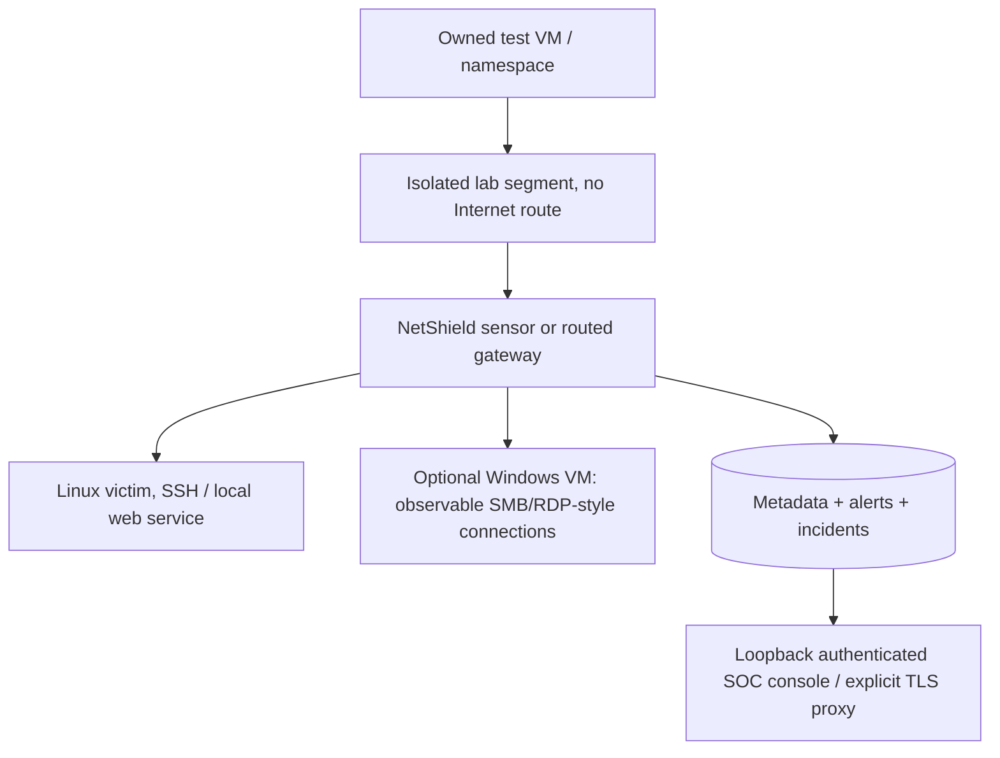

# Home SOC topology and visibility

Start with portable replay; no VM is necessary. The optional minimal live demo needs one owned Linux VM containing the two disposable namespaces in ATTACK-LAB.md.

For a larger home lab, use an isolated switch/vSwitch segment and a gateway or authorized mirror/TAP as the capture point. A sensor attached as an ordinary endpoint sees only packets delivered to it; promiscuous mode alone does not provide visibility into every switched conversation. Scope interface/CIDRs before starting capture. Keep management on a separate reachable protected path; do not attach the test segment to bridged public networking. Optional Windows telemetry is network metadata, not an installed agent or authenticated Windows log integration.

Observe and respond are different placement capabilities: the owned nft input/forward hooks affect only traffic traversing that host/namespace. A mirror sensor cannot block a remote switch path merely because it sees a packet. Endpoint blocking affects packets arriving at that endpoint; gateway blocking affects routed packets through that gateway. Document the placement and verify connectivity alongside kernel presence in a live demo.

Preserve local IP/gateway/resolver and remote admin host protections. Keep root-owned code/policy separate from netshield-writable evidence. Do not reuse Docker Desktop's managed WSL kernel for privileged namespace testing. A dedicated lab VM can be snapshotted by its owner; no VM creation/OS installation is automated here.
