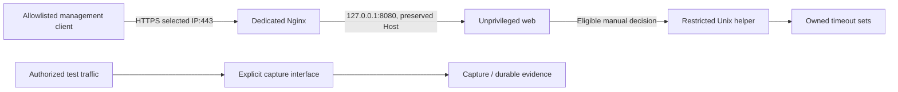

# Canonical Linux installation

`install.sh` is the single entry point, backed by a standard-library Python installer. New deployments need no JSON, systemd or proxy hand editing. Target: booted **Ubuntu 22.04 or 24.04 with systemd**, root/sudo, package network access, a reviewed source checkout, and explicit capture/management choices. **The new automation has not yet run on Linux.** The earlier manually deployed Ubuntu 22.04.5 lab acceptance is documented separately in [Linux acceptance](LINUX-ACCEPTANCE.md). Ubuntu 24.04 is a target, not a verified runtime claim.

Clone the public source repository:

```sh
git clone https://github.com/YousefE1bana/Net-Shield.git
cd Net-Shield
chmod +x install.sh
sudo ./install.sh
```

From an existing checkout, run `sudo ./install.sh` at its root. The installer displays interfaces and asks for capture interface, local management IP, allowed management client IP/CIDR and sensor ID. Host-only/internal networks are suitable for the owned lab; keep NAT/internet management separate where possible. Network choices are never guessed silently. A broad client ACL broadens access to the login page and response protection scope; choose the narrowest practical range.

Observe-only is the default. Capture is separate; automatic response is always false. Initial operator creation invokes secure `getpass` as the service user. There is no default password, password flag or password environment variable. Blank username or `--skip-operator` postpones creation.

## Modes and examples

```sh
sudo bash install.sh --help
sudo bash install.sh --dry-run
sudo bash install.sh --verify-only
```

Dry-run is read-only platform/resource/network discovery and a printed plan; no apt, build, account, file, certificate, service or firewall changes. It requires the Ubuntu discovery tools and does not predict apt availability. Verify-only checks an existing managed deployment without database initialization, pruning, reconciliation, traffic generation or rule mutation.

The following are **examples**, not defaults. Replace them with your owned environment:

```sh
sudo bash install.sh --non-interactive --skip-operator \
  --capture-interface ens34 --management-ip 192.168.100.20 \
  --management-client 192.168.100.1/32 --sensor-id lab-sensor
```

Repeat `--management-client` for additional clients. Optional `--hostname console.lab` adds a DNS SAN and trusted host; configure resolution separately. Literal IPv6 management is supported by bracketed Nginx rendering; link-local/wildcard management is refused.

Manual helper startup additionally requires **both** `--enable-response` and explicit private `--response-network CIDR` (repeatable). Only RFC1918/ULA response scopes are accepted. Startup creates the exact owned nftables table but inserts no block and runs no attack. Subsequent actions still need eligible live evidence, authenticated authorized analyst, reason, finite TTL and kernel readback. Replay/lab cannot call the host helper.

## Python and packages

Python 3.11+ with venv/ensurepip is required. Ubuntu 22.04's [default Python 3.10](https://packages.ubuntu.com/jammy/python3) is insufficient; Ubuntu 24.04's [default package is Python 3.12](https://packages.ubuntu.com/noble/python3). The installer prefers a root-owned supported interpreter, or `--python /absolute/path/python3.12`, installing its Ubuntu venv package if needed. Custom interpreters must already include ensurepip.

On Jammy without a supported interpreter, installation stops unless the operator explicitly approves the **third-party deadsnakes PPA** interactively or passes `--allow-deadsnakes`. That adds `ppa:deadsnakes/ppa` and Python 3.12/venv: an OS trust decision, not an official Ubuntu repository. Alternatively provision reviewed Python yourself. Ubuntu 24.04 uses native Python 3.12. The system Python is not replaced.

Packages: Nginx, OpenSSL, nftables, iproute2, CA certificates and required Python/venv support. A root-private build copies reviewed build inputs, builds a wheel with pinned setuptools and installs pinned runtime dependencies. No editable install. `pip check` verifies consistency. Package retrieval needs network access; installation is not hermetic/offline.

## Layout and privilege

| Resource | Boundary |
|---|---|
| `/opt/netshield/releases/<build>/venv` | New root-owned immutable runtime per install; old runtime/wheel retained |
| `/opt/netshield/venv` | Root-owned atomic active-runtime link, not service-writable |
| `/etc/netshield` | root:netshield 0750, app/helper JSON 0640 |
| `/etc/netshield/install-state.json` | Root-only 0600 ownership/hash ledger, no operator password |
| `/etc/netshield/tls` | Root-only 0700; key 0600; reused on reruns |
| `/var/lib/netshield` | netshield:netshield 0700, private existing database/operators/evidence preserved |
| `/run/netshield` | Helper/systemd-managed root:netshield 0750, socket 0660 + SO_PEERCRED |
| `/run/netshield-proxy` | Dedicated proxy runtime directory managed by systemd |

The system account has nologin shell and `/var/lib/netshield` home; existing properties are validated. UID/GID are resolved dynamically. Initialization/migration and operator creation run **as netshield**, with existing application pre-migration backup behavior.

| Unit | Authority |
|---|---|
| web | netshield, no capabilities; 127.0.0.1:8080 |
| capture | netshield, CAP_NET_RAW only |
| maintenance service/timer | netshield, no capabilities; timer every minute |
| helper | Opt-in root, CAP_NET_ADMIN + CAP_CHOWN only |
| proxy | Dedicated Nginx master with bounded bind/user-switch/chown capabilities; www-data workers |

All units use NoNewPrivileges and the Python services use isolated `-I` mode to prevent writable-working-directory/PYTHONPATH imports. AF_NETLINK in web/maintenance permits iproute2 discovery and grants no network-admin capability. The web server never starts the helper.

## TLS and isolation



The dedicated `/etc/netshield/nginx.conf` includes no global/foreign sites. It binds only the selected IP:443, preserves Host/X-Real-IP/X-Forwarded-For, sets X-Forwarded-Proto=https, enables TLS1.2/1.3, disables server tokens, and applies explicit client allow lines followed by deny-all. Generated app settings use `secure_cookie=true` and actual external trusted hosts. Backend stays loopback. Proxy headers do not create an application identity or a per-forwarded-client rate-limit guarantee.

Existing Nginx sites/defaults and nginx.service stay intact. Conflicting selected-IP/wildcard HTTPS or backend listeners are refused before installation changes. During apt, a temporary policy-rc.d **only when none already exists** prevents auto-starting a fresh global default site; the exact temporary file is removed afterwards. Existing startup policy is respected. Existing services/firewalls are never disabled.

First installation generates a 365-day self-signed RSA certificate with IP SAN and optional explicit hostname SAN. Deliberately trust its fingerprint on your management client; it is not public-CA trust. Alternatively supply `--cert /root/console.crt --key /root/console.key` together. SAN, key match and validity are checked; private key bytes are never logged. Reruns reuse certificates rather than silently rotate them. Expiry/mismatch fails verification; renewal is separate reviewed maintenance.

Both app and helper receive discovered protections: all local addresses, loopback/link-local, management client CIDRs, IPv4/IPv6 default gateways, resolver IPs (including resolved upstream DNS when available), and connected subnets of **non-capture** interfaces. Helper also independently discovers infrastructure at startup. When capture and management share an interface, the entire capture subnet is not automatically protected; explicit clients/local addresses still are. Overlapping non-capture protections can intentionally prevent response within a scope; review the plan. New unprotected infrastructure on rerun is refused rather than silently weakening policy. DHCP/network changes need coordinated reviewed policy/restart. No forwarding, routes, interface configuration or VMware settings change.

## Reruns, failure and manual installations

`sudo bash install.sh --skip-operator` reuses recorded choices. Hashes/ownership checks refuse foreign files, symlinks, missing files and operator-modified managed resources. Identical files are untouched; intentionally updated managed units get root-only backups. Network choices cannot silently change through rerun flags. Database/operator records and certificates remain intact.

Each install builds a new runtime, stops the exact units before switching the root-owned link, and retains previous runtime/wheel and existing pre-migration backup behavior. This is **not transactional rollback** of packages, schema or services. Failure may leave services stopped or a new runtime needing administrator recovery. It does not erase evidence, remove build history, flush rules or sweep resources. Inspect `journalctl -u netshield-web -u netshield-capture -u netshield-helper -u netshield-proxy` and the private ledger before retrying. Interrupted writes/partial resources can require ownership review. Never delete the database to retry.

Existing **manual deployments** without this ledger are refused, including the accepted VMware copy. Test a fresh owned VM first; migrate the existing deployment only through a reviewed backup/ownership plan. Do not remove accepted data/files to bypass checks. No destructive uninstall/purge flag is supplied.

## Verification and acceptance

Post-install/verify-only checks dependency consistency; managed files; active web/capture/proxy/timer and expected helper state; unit users/capabilities/families/no-new-privileges; real web/capture/helper PID UID/capabilities; root-owned non-writable runtime/config and writable private data; key permissions; actual loopback/TLS listeners; certificate identity/validity; TLS handshake/local ACL expectation; backend login redirect; a fresh durable running sensor heartbeat; and, when enabled, socket ownership, service-peer list, root-peer denial and strict owned nft schema.

The TLS self-probe expects **403** if the sensor IP is outside the client ACL. It does not secretly allow the sensor to make a test pass. Backend login redirect is checked separately. Real allowed/denied client access remains an operator check. Heartbeat does not establish complete coverage or packet-loss capacity. Installer never runs a scan/block/lab scenario.

Before calling this new installer accepted, retain fresh Ubuntu first-install/rerun/verify-only, observe-only/explicit-helper, failure-path, unrelated-site/firewall preservation and real client ACL evidence. The supplied manual runtime acceptance does not cover the newly created automation.

Deferred operator creation:

```sh
sudo runuser -u netshield -- /opt/netshield/venv/bin/python -m netshield \
  --config /etc/netshield/config.json operator-add yousef
```

Portable replay, trusted service producers, backup/retirement and development checks remain in [INSTALL](INSTALL.md). Retire only exact NetShield services/resources after reviewing active finite blocks; preserve data by default and never reset unrelated firewall rules.
