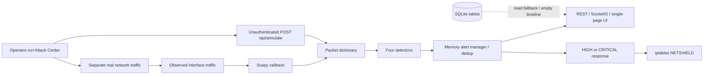

> **Historical phase record.** Phase-specific approval/publication constraints below describe that completed phase. Current public-source status, Apache-2.0 license and verification are recorded in [PUBLICATION](PUBLICATION.md) and the [README](../README.md). Installer Linux lifecycle acceptance remains pending.

# NetShield — Current-State Audit

**Audit date:** 2026-10-03. **Scope:** the existing local NetShield source checkout. **Phase:** reconnaissance and planning only.

This is the factual baseline for [NETSHIELD-V2-PLAN.md](NETSHIELD-V2-PLAN.md). Product code was not changed. No real capture, attack traffic, firewall operation, installation, commit, push or publication was performed. Safe application probes used external temporary databases/logs, disabled capture and mocked firewall/lifecycle boundaries. The GitHub repository `YousefE1bana/Net-Shield` was supplied as the future destination; it was not contacted or modified.

## 1. Executive assessment

NetShield contains a real Python packet parser, heuristic detector pipeline, Flask/SocketIO dashboard, iptables adapter and separate traffic-generation scripts. It is more than a static dashboard, but it is currently an educational prototype, **not a verified deployable NDR/SOC tool**.

The largest gaps are correctness and trust boundaries, rather than the age of Flask or SQLite:

- Administrative HTTP and SocketIO operations have no authentication. The documented startup runs the entire dashboard/capture/firewall process with `sudo`.
- Synthetic packet dictionaries enter the same pipeline as capture and can authorize real firewall changes. The Attack Center reports synthetic attacks before generating actual traffic, so dashboard alerts do not validate detection of the real attack.
- Firewall failures can return success. Temporary-block ownership and expiry are memory-only; stopping or restarting can leave real rules behind. Source selectors are not validated as single hosts.
- Several detectors overstate their evidence. SSH SYNs are called failed authentication; ordinary TLS application records are called SSL stripping; ARP claims can cause blocking of the impersonated host.
- SQLite tables exist, but operational alerts, blocks and traffic are not written to them. The dashboard cannot support durable investigation or meaningful historical charts.
- Capture, parsing, every detector and synchronous firewall calls share one packet callback. There are no throughput, drop or backpressure measurements.

**Disposition:** retain useful Python modules and the detection concepts; repair data contracts, provenance, privilege separation and response semantics before expanding the UI or advertising protection.

## 2. Evidence standard and verification boundary

The audit inspected all inventoried text source, configuration and documentation, traced inputs to consumers, and obtained independent static architecture/security reviews. Findings below cite source locations; filenames alone were not used as capability evidence. Compiled caches are inventoried but not authoritative.

Status labels used in this report:

| Label | Meaning |
|---|---|
| Implemented and working | Observed in a safe local probe, within the stated boundary; not proof of Linux deployment |
| Implemented but incomplete | Executable implementation exists, with missing semantics or integration |
| Broken | A source defect and/or reproducible safe probe contradicts intended behavior |
| Placeholder/mock | Synthetic or example-only behavior that does not establish a live capability |
| Missing | No implementation found in the inspected source |
| Technically risky | Works or can work, but its design creates material correctness, safety or operational risk |

### Checks performed

| Check | Result and limits |
|---|---|
| Workspace inventory and Git state | 47 pre-existing files. This directory has no Git repository; `git status`/`rev-parse` cannot establish a branch/history |
| Python syntax | All 20 Python files parsed/compiled in memory. A banner escape in `dashboard/app.py` produces a `SyntaxWarning` under Python 3.14; no syntax failure |
| JavaScript syntax | `node --check dashboard/static/js/dashboard.js` passed |
| Shell syntax | `bash -n setup.sh` was used; setup itself was not run |
| Dependency environment | Python 3.14.6; installed Flask 3.1.3, Flask-SocketIO 5.6.1, Scapy 2.7.0 and Requests 2.34.2. Paramiko/eventlet were unavailable. Global `pip check` passed; this is not a clean installation of the complete requirements |
| Flask smoke | `/`, six read APIs and both static assets returned 200 with external temporary state and capture disabled |
| Detector/response probes | Deterministic packet dictionaries and locally constructed Scapy packets, with no sends/sniffing. Firewall subprocesses mocked. Confirmed threshold, TLS, IPv6, attribution, state, API and concurrency defects described below |
| SocketIO | Test client with an untrusted Origin connected without authentication; mocked start handler was reached. No real browser cross-origin network attack was performed |
| Database | Original database inspected with read-only immutable SQLite URI: integrity `ok`; alerts, blocked_ips and traffic_logs all have zero rows |
| Browser | Real Chromium rendering of loopback-only app at 1440×1000 and 320×900. Capture/start/stop disabled, automatic response disabled, firewall adapter neutralized. Existing CDN assets loaded; no page/request errors in this run |
| UI state | Synthetic alert visible while engine Offline and captured packets zero. Clear changed the client to SAFE while the server retained the alert. Mobile document width 359px at 320px viewport |
| Preservation | SHA-256 baseline recorded for all original files; safe probes preserved their contents. Final document delivery is checked against the same baseline |

No pytest/Ruff project suite exists. No lint/type-check, automated WCAG audit, sustained load, Linux privileges, real packet visibility, successful kernel blocking, kernel expiry, real attack scripts, cloud/container deployment or installed dependency advisory audit was validated. No performance or CVE claims are made.

## 3. Complete existing directory structure

Before these two audit documents, the workspace contained:

```text
NetShield/
├── config.py
├── requirements.txt
├── setup.sh
├── README.md
├── PROJECT_DOCUMENTATION.md
├── netshield.db
├── __pycache__/config.cpython-311.pyc
├── attack_scripts/
│   ├── attack_center.py
│   ├── ddos_sim.py
│   ├── brute_force_sim.py
│   ├── port_scan_sim.py
│   └── ssl_strip_sim.py
├── dashboard/
│   ├── app.py
│   ├── api.py
│   ├── models.py
│   ├── templates/index.html
│   ├── static/css/dashboard.css
│   ├── static/js/dashboard.js
│   └── __pycache__/{app,api,models}.cpython-311.pyc
├── ids_engine/
│   ├── __init__.py
│   ├── core.py
│   ├── packet_capture.py
│   ├── alert_manager.py
│   ├── mitigation.py
│   ├── __pycache__/{__init__,core,packet_capture,alert_manager,mitigation}.cpython-311.pyc
│   └── detectors/
│       ├── __init__.py
│       ├── base.py
│       ├── ddos_detector.py
│       ├── brute_force_detector.py
│       ├── port_scan_detector.py
│       ├── ssl_strip_detector.py
│       └── __pycache__/{__init__,base,ddos_detector,brute_force_detector,
│                      port_scan_detector,ssl_strip_detector}.cpython-311.pyc
├── docs/
│   ├── architecture.md
│   └── setup_guide.md
├── logs/netshield.log
└── reports/.gitkeep
```

There is no test directory, CI workflow, executable container manifest, Dockerfile, Compose file, systemd service, package manifest, lockfile, `.gitignore`, LICENSE, CONTRIBUTING, issue/PR template, screenshot collection or report generator. `reports/.gitkeep` reserves a directory; it does not implement export. No applicable `AGENTS.md` was found in this workspace or its directory ancestors.

## 4. Technologies and application architecture

| Layer | Actual implementation |
|---|---|
| Language/platform | Python; Linux-oriented network capture/firewall and shell setup; current checkout on Windows |
| Capture | Scapy, daemon Python thread, `sniff(iface=..., store=False, prn=...)` |
| Detection | Four detector objects, synchronous per-packet `analyze()` calls, per-source in-memory counters/maps |
| Web | Flask blueprint and factory; Flask-SocketIO in `threading` mode; development Werkzeug explicitly permitted |
| State | In-memory alert deque, counters, block OrderedDict/history; independent SQLite schema/helpers |
| Frontend | One Jinja HTML page, custom CSS, vanilla JavaScript, Chart.js, Socket.IO client; remote CDNs/Google Fonts |
| Lab | Scapy, Requests, Paramiko and standard sockets in operator-run CLI scripts |
| Mitigation | `iptables` subprocess argv, dedicated NETSHIELD chain; **not UFW** |
| Logging | Console plus unrotated file handler configured at core import |

`requirements.txt` declares minimum versions without upper bounds or a lock: Scapy, Flask, Flask-SocketIO, eventlet, Paramiko, Requests and Colorama. Eventlet is not selected by the application; lab dependencies are mixed into runtime dependencies.



The factory in [dashboard/app.py](../dashboard/app.py) constructs all components in the web process and returns an `(app, socketio, ids)` tuple. The main entry point starts the IDS then serves `0.0.0.0:8080`, with `debug=False`, `use_reloader=False`, and `allow_unsafe_werkzeug=True` (lines 31–80, 101–113). No separate worker, privilege dropping or supported WSGI entry point is implemented.

### Packet capture and parsing

`ids_engine/packet_capture.py`:27–128, 143–195:

- Scapy captures on hardcoded `ens33` by default. There is no BPF filter, bounded delivery queue or drop accounting.
- Dictionaries contain processing timestamp, IPv4 addresses, ports, protocol label, TCP flags, length, MACs, raw/decoded payload and some HTTP fields. Timestamp uses `time.time()`, not captured `packet.time`.
- Ethernet/ARP/IPv4/TCP/UDP/ICMP are recognized. ARP returns early and loses operation/context. IPv6 transport may be recognized while addresses remain empty.
- Plaintext methods mark the protocol `HTTP`, overwriting the transport classification. HTTP responses provide status/Location, but not the `http_url` required by one detector branch.
- There is no TCP stream assembly, retransmission deduplication, fragment handling, DNS/TLS metadata pipeline, flow tracking or PCAP read/write/replay integration. HTTPS application content is not visible.
- Entire payload bytes and a decoded string can be retained during analysis; there is no explicit payload size/redaction policy.
- Capture callback runs parsing, all detectors, alert broadcast and potentially a blocking firewall subprocess. A five-second firewall timeout can stall intake. `store=False` is a good choice but does not address callback throughput.
- PPS updates only when another packet arrives after an interval, without division by elapsed time; idle values can remain stale.
- `stop_filter` is evaluated upon another packet; a quiet capture may survive the three-second join. Restart can overlap a previous sniff thread. Missing Scapy leaves capture marked running in “simulation mode”; capture exceptions do not consistently change core running state.

No switched-network visibility is guaranteed by this code. Capturing on a third VM in the same subnet does not establish visibility of unicast Kali→victim traffic without mirroring, bridging, routing or a target-local sensor. Capture and enforcement placement must be demonstrated separately.

## 5. Every implemented detector

Four classes implement multiple alert types. Their names should not be treated as verified attack attribution.

| Detector / branch | Actual decision | Status / limitations |
|---|---|---|
| DDoS: SYN | Source-only count of TCP SYN without ACK ≥100 in 10s | Threshold crossing works in probe; comment says 100/sec, actual threshold is count/window (reported average 10/sec). No handshake outcome or distributed target aggregation |
| DDoS: HTTP | Source-only plaintext request count ≥50 in 10s | Works on parsed request packets, not complete requests or encrypted HTTP; comment says 50/sec, actual average threshold 5/sec |
| DDoS: UDP | Source-only UDP count ≥200 in 10s | Works in probe, actual average 20/sec instead of comment 200/sec; ordinary high-rate UDP and spoofing unaccounted for |
| Brute force: SSH | Source-only TCP packets to port 22 containing `S` ≥5 in 60s | Broken semantic claim: SYN and SYN-ACK count, with no authentication result, session or retry deduplication |
| Brute force: HTTP | POSTs to ports 80/443/8080 ≥10 in 60s; login-looking text increases severity | Non-login POSTs still HIGH. No failed-login outcome/correlation. TLS bodies cannot be read |
| Port scan | ≥15 distinct destination ports per source inside a fixed first-seen 30s window | Mixed destinations combine; latest target receives attribution. SYN-ACK accepted; configured SYN-only flag unused. Not a true rolling window; port set resets after alert |
| “SSL strip”: ARP change | Claimed source IP changes from remembered MAC | Detects binding change, not verified attacker/MITM. Legitimate failover/DHCP can trigger; source is victim/gateway claim, eligible for CRITICAL auto-block |
| “SSL strip”: ARP volume | ≥10 ARP packets per source in 10s | Comments imply per-second/replies; operation is not parsed, so requests count too |
| “SSL strip”: port 443 | TCP payload first byte differs from TLS handshake byte `0x16` | Broken: valid TLS application record `0x17` triggers CRITICAL. Plaintext HTTP on 443 is parsed as HTTP and bypasses this branch |
| “SSL strip”: redirect | 301/302 plus `http://` in request URL and Location | Normal parsed response has empty request URL and misses condition. An HTTP redirect alone would not establish original HTTPS interception anyway |

Evidence: `ddos_detector.py`:79–170; `brute_force_detector.py`:45–100; `port_scan_detector.py`:45–103; `ssl_strip_detector.py`:43–111; `base.py`:116–147.

Counters are partly rolling deques, but cleanup occurs only when a key is revisited. A probe left 1,000 expired events retained under abandoned source keys. Unique-attacker/scanner sets, ARP bindings, scan trackers and deduplication maps have no global cardinality/TTL bounds. Base `reset()` resets statistics, not each subclass's detection state. Concurrent capture and HTTP simulation can mutate detector state without a consistent lock or single-owner queue.

## 6. Events, persistence and observability

### Alert/event model

`BaseDetector.create_alert()` produces dictionary alerts with detector/type, severity, source/destination identity/ports, description, details and wall-clock timestamp. AlertManager assigns a process-local sequence ID and stores at most 10,000 alerts in a deque. Deduplication hashes detector/type/source/destination for 30 seconds; it excludes ports/severity, drops repeats instead of retaining occurrences, and never globally prunes its hash map (`alert_manager.py`:29–90).

Consequences: severity escalation or different service evidence may disappear; detector alert counters differ from accepted alerts; IDs collide across process restarts; no provenance, rule version, stable event ID, acknowledgment/resolution, assignment, incident link, evidence chain or durable audit exists. Locks protect some alert operations, but not all counter reads or shared detector state.

### SQLite

`dashboard/models.py`:17–119 creates WAL connections and tables `alerts`, `blocked_ips`, `traffic_logs`, with selected indexes. SQL inputs are parameterized; **SQL injection was not established**.

`save_alert()` and `save_traffic_snapshot()` have no runtime callers. Block state is never written/restored. Normal `/api/alerts` uses the initialized in-memory manager; timeline reads SQLite. The supplied database is valid and empty. A synthetic alert was retained in memory while all three temporary DB tables stayed empty. WAL configuration is present, but does not repair the absent write integration.

No migrations, explicit retention, backup/restore process, schema version, durable response history, relationships or actor fields exist. Alert timestamps and the database's stored timestamps also need one consistent UTC event-time contract.

### Health, jobs and logging

- Daemon capture, one-second statistics and ten-second mitigation-cleanup threads; core start/stop lacks a lifecycle lock and coordinated joins.
- Core `_running` is set before capture readiness. Dashboard “running” is not evidence of a functioning interface or response helper.
- `core.py:118–123` compares uppercase protocol labels with lowercase keys; probe counted TCP as `other`. Protocol charts therefore lack a correct source metric.
- Selected callback errors are logged; statistics broadcast exceptions are swallowed. No structured failure events, heartbeat deadlines, drop/queue metrics, freshness, persistence errors, disk budget or health API exists.
- File logging is configured during import, writes to `logs/netshield.log`, and has no rotation/retention. Raw supplied strings can reach messages; no redaction or log-format policy is defined.

## 7. Response implementation and security audit

`ids_engine/mitigation.py` uses `iptables -A/-D NETSHIELD -s <ip> -j DROP`. `setup.sh:57–65` links this chain into INPUT and FORWARD. UFW was historical context, **not the current implementation**.

The argv form, timeout and exact whitelist are real controls. `shell=True` is not used: **shell command injection through the IP field was not established**. Nonetheless, argv safety does not validate an iptables selector.

| ID / priority | Validated finding | Evidence / impact boundary |
|---|---|---|
| NS-S1 / P0 | No identity/authorization on HTTP or sockets; wildcard socket origins | `app.py:40,58–80`; `api.py:60–118`. Mocked calls reached control handlers without credentials. All-interface default; actual public deployment unknown. Documented root process amplifies consequences |
| NS-S2 / P0 | Single-host response accepts arbitrary source selectors | `mitigation.py:70–87,130–140`. Mocked request accepted `0.0.0.0/0`, bypassing exact host whitelist and creating broad argv. Real effect requires working privileged iptables/chain |
| NS-S3 / P0 | Untrusted strings become dashboard HTML/inline handlers | `dashboard.js:308–314,425–432`; simulation source enters detector description, block reason/IP enter table. Static source-to-DOM trace; no executable browser exploit was run |
| NS-S4 / P0 | Synthetic and spoofable identities authorize live blocking | `core.py:125–144`, `mitigation.py:168–177`. Simulation runs while stopped; ARP claims target the impersonated IP. No origin or source-ownership gate |
| NS-S5 / P0 | Failed firewall add/delete reported as success | `mitigation.py:140–153`. Mocked nonzero exit and missing executable returned success. Failed deletion loses tracking of a rule that might remain |
| NS-S6 / P1 | Attacker-controlled state grows without global eviction | `base.py:116–147`, detector maps, `alert_manager.py:35–59`. Idle-key probe confirms retention. Actual exhaustion threshold not benchmarked |
| NS-S7 / P0 | Duplicate rule race / admission limit race | `mitigation.py:74–100,112–117`. Controlled two-thread interleaving produced two mocked add calls and one tracked entry. One delete can leave an untracked rule |
| NS-S8 / P0 | “Temporary” blocks can outlive detection/process lifetime | `core.py:105–110`, `mitigation.py:39–55,155–166`. Cleanup stops with engine; new process forgets rules and refuses untracked unblock. No real kernel expiry test |

Other response debt: `AUTO_MITIGATION_ENABLED=False` also disables manual blocks; duration uses `duration or default` without bounds; the exact whitelist contains only loopback and configured IDS IP; maximum applies to tracked entries, not affected hosts; history is memory-only with no public history API; broadcasts occur inside mutation locks; unlocked block iteration can race. Timeout returns failure, while most other failures return success. An L3 DROP rule does not remedy L2 ARP poisoning. A passive mirror sensor cannot enforce traffic that does not traverse its INPUT/FORWARD path.

## 8. Actual routes and socket contract

| Method / path | Actual behavior |
|---|---|
| GET `/` | Single dashboard template |
| GET `/static/<path>` | Dashboard CSS/JS/static files |
| GET `/api/stats` | Core, capture, detector, alert, mitigation statistics |
| GET `/api/alerts` | Memory alerts normally; `limit`, `severity`, `type` filters |
| GET `/api/blocked` | Current process block dictionary |
| GET `/api/attacks/timeline` | Database aggregation with `hours` parameter; empty with current unwired writes |
| GET `/api/detectors` | Detector statistics; no mutation route |
| GET `/api/engine/status` | Core running flag and uptime |
| POST `/api/engine/start`, `/api/engine/stop` | Start/stop same-process engine |
| POST `/api/mitigation/block` | JSON `ip`, optional `reason`; calls mitigation |
| POST `/api/mitigation/unblock` | JSON `ip`; calls mitigation |
| POST `/api/simulate` | Fixed SYN/SSH/scan/ARP/HTTP dictionary batches using supplied claimed identities; no real packets transmitted |

Socket inputs: `connect`, `start_engine`, `stop_engine`, `request_stats`. Outputs include `connection_ack`, `engine_status`, `full_stats`, `traffic_update`, `new_alert`, `mitigation_applied`. Some responses broadcast to all clients, rather than only the requester.

API validation is ad hoc. Array JSON causes a 500; an unknown simulation type returns success with zero generated dictionaries. Query bounds/body schemas/content limits are absent. No CSRF, route permissions, session login, socket authentication, rate limiting or consistent error contract exists. A random Flask secret is generated at every config import; this is not authentication and would disrupt durable future sessions.

The documentation lists APIs such as `/api/status`, `/api/alerts/<id>`, resolve, blocked-ips, traffic-stats and detector-toggle, plus socket names not present in source. Those are unimplemented descriptions, not capabilities.

## 9. Attack Lab audit

There are two distinct things: **synthetic dashboard injection** and **real operator-run network tools**. No HTTP endpoint launches the external CLI scripts or arbitrary user commands.

| Script | Actual capability and debt |
|---|---|
| `ddos_sim.py` | Real SYN sending and HTTP GET loop. No target/interface policy or global rate budget; HTTP follows redirects by default. Loop counters can count attempted/failed work |
| `brute_force_sim.py` | Real Paramiko credential attempts and HTTP credential POSTs. AutoAddPolicy trusts unknown host keys; weak success heuristic; prints credentials. Attempt allocation/wordlist cap inconsistent; HTTP default port can remain 22 |
| `port_scan_sim.py` | Real connect and SYN scans. Unbounded port parser; no 1–65535 range validation. Sequential timeouts may miss current detector's window; socket cleanup incomplete on exceptions |
| `ssl_strip_sim.py` | ARP poisoning only, **not an SSL downgrade proxy**. Failed MAC discovery falls back to broadcast; selected interface not consistently passed to send; restoration not guaranteed on every failure |
| `attack_center.py` | Duplicates generators, connects to dashboard and posts `/api/simulate` before real traffic. Reports omit real target; HTTP brute reports SSH, UDP/quick steps report SYN. Dependency absence can fall back to synthetic success. Quick ARP demo has no restoration; other restoration may resolve MAC after poisoning |

Evidence: `attack_center.py:141–166,303,455,491,563–572`; `ssl_strip_sim.py:59–116`; generator argparse and send/connect loops.

The warnings say authorized educational lab use. These are advisory notices: targets can be arbitrary, no explicit lab mode, positive target/interface allowlist, routing isolation, global budget, scenario manifest, execution audit, cleanup lease or expected-result assertion is implemented. Fixed `os.system` calls clear the console; they are not an arbitrary-command execution facility.

Topology/address defaults disagree across config, API, guide and Attack Center. The original Windows 7 victim and blanket root/network capability guidance are unsuitable defaults for a new public release. Nothing was attacked during this audit.

## 10. Current UI/UX evaluation

The existing UI is custom rather than Bootstrap. It has consistent dark styling, recognizable severity colors, responsive breakpoints, visible engine controls, charts, an alert feed and a blocked-IP table. It renders successfully with the CDN dependencies available. These are useful foundations, but current operations UX does not support investigation.

### Information correctness

- “No alerts — System is secure” and SAFE appear while capture is Offline. Four “active detectors” and LIVE chart badges are unconditional. No data is not evidence of safety.
- Traffic series append cumulative counters, not fixed-duration rates. Polling and SocketIO both append samples, producing different cadences/duplicates. The backend case defect routes protocols to `other`.
- Attack distribution is browser-session state; UDP is mapped into HTTP and HTTP brute force into SSH. Reload changes interpretation; it is not historical analytics.
- Feed polling only requests 20 records. Process-local `lastAlertId` rejects lower IDs after restart and can miss burst/out-of-order events. No cursor/reconciliation contract exists.
- Clear removes displayed items and sets SAFE but does not resolve/delete backend alerts; it leaves distribution and other counters inconsistent. Browser probe confirmed one server alert remained.
- Fetch failures are largely swallowed. Stale data, disconnected transport and failed response operations have no clear degraded state. Missing Chart.js can abort initialization rather than degrade to tables.

### Interaction and visual quality

Large statistic cards and attack buttons consume the prime investigation area. Gradients, glow, emojis and a flashing critical strip compete with evidence. Tiny descriptions/severity text and muted contrast need measured redesign. The alert feed has no drill-down, structured evidence, lifecycle, assignment or source context. There is no global time selector, query workflow, sorting, pagination, saved view or filter UI despite two server filters.

Responsive CSS exists, but a 320px viewport produced a 359px document with clipping/overflow. Canvas charts have no accessible name or text equivalent. No reduced-motion stylesheet exists; critical-state CSS uses perpetual flashing. One native keyboard focus was observed, so the audit does not claim all controls are unfocusable. Full keyboard, screen reader, zoom and automated WCAG validation were not performed.

**V2 implication:** redesign around truthful freshness/coverage, searchable tables, evidence drawers, timelines and contextual actions. Preserve custom identity without preserving misleading metrics or unsafe HTML construction.

## 11. Consolidated feature matrix

| Capability | Classification | Verified assessment |
|---|---|---|
| Flask page/read APIs/static assets | Implemented and working | Safe local smoke and browser rendering; deployment not verified |
| Packet dictionary parser | Implemented but incomplete | Locally parsed IPv4/ARP/TCP/HTTP; IPv6/context/stream semantics broken or absent |
| Live interface capture | Implemented but unverified / risky | Real Scapy sniff path; no live capture allowed in this phase |
| SYN/HTTP/UDP threshold triggers | Implemented and working, risky semantics | Deterministic threshold crossings; labels/units/attribution need correction |
| SSH/HTTP authentication-failure detection | Broken claim | Current connection/POST heuristics do not establish failed authentication |
| Port-scan heuristic | Implemented but incomplete | Distinct ports trigger; destination mixing/window/SYN-ACK defects |
| ARP binding-change indicator | Implemented but incomplete / risky | Change triggers; sender attribution, baseline and response unsafe |
| SSL stripping/MITM confirmation | Broken / missing | Invalid TLS heuristic; no downgrade proof or proxy |
| Alert feed/deduplication | Implemented but incomplete | Memory only; no occurrence history/lifecycle |
| SQLite operational persistence | Broken integration | Schema/helpers exist, no operational writes |
| Firewall subprocess construction | Implemented but technically risky | argv control exists; typed host/policy/state verification absent |
| Actual block enforcement | Unverified | Kernel not touched; mocked failures reveal false success |
| Temporary expiry/unblock | Implemented but broken lifecycle | Cleanup exists; no restart ownership/recovery |
| UFW | Missing | Current backend is iptables |
| Synthetic demo | Placeholder/mock | Dictionaries, not captured traffic; mixed with live response |
| Real CLI traffic generators | Implemented but unverified / risky | Source sends real traffic; no execution during audit |
| Closed-loop Attack Lab validation | Missing | Pre-injected alerts invalidate current demo evidence |
| Historical traffic/protocol analytics | Broken/incomplete | Case bug, cumulative/session charts, empty DB |
| Flow explorer / assets / incidents | Missing | No durable corresponding model or screens |
| Rules configuration UI | Missing | Python constants only |
| Authentication / audit log / RBAC | Missing | Documentation examples are not controls |
| PCAP capture/replay/export | Missing | Scapy's library capability is not app integration |
| Webhooks / Syslog / SIEM | Missing | No integration implementation |
| Health/observability | Implemented but incomplete | Own flags/basic counts; no readiness/drop/freshness model |
| Deployment automation | Implemented but risky/incomplete | Root apt/setup script; other deployment manifests are prose |
| Tests / CI / license / public-release assets | Missing | Needs explicit work before GitHub release |

## 12. Deployment and documentation gaps

`setup.sh` performs apt update **and upgrade**, installs packages, creates a venv and installs unconstrained requirements, creates log/report paths, backs up firewall rules under `/tmp`, and installs NETSHIELD chain jumps. It does not explicitly install iptables, validate end-to-end enforcement, implement safe restore or create the referenced service file. Invoking `sudo python3` after activating a venv may resolve a different interpreter through sudo's environment policy.

Docker/Kubernetes/cloud snippets in `PROJECT_DOCUMENTATION.md` are documentation only. Environment variables advertised there do not override `config.py`; `/app/netshield.db` would be outside the illustrated logs/reports mounts. Host networking and generic-interpreter NET_ADMIN/NET_RAW guidance enlarge the privilege boundary. A reverse proxy example does not close the default backend listener or supply the absent authorization.

README declares educational-only intent, while other prose uses “Production Ready.” There is no actual LICENSE file or verified copyright permission covering all original authors/assets. An educational-use restriction is not an open-source license. The new repo needs a rights decision before publication; no relicense was done here.

## 13. What remains unknown

Actual Linux interface/UID/capabilities, routing/mirroring, kernel firewall backend/rules, deployment exposure, packet-drop rate, reliable capacity, behavior under sustained malformed traffic, real attack detection coverage, false-positive rates, firewall coexistence and crash recovery all require later isolated integration tests. The empty supplied DB is evidence of its current contents, not proof that no external version ever persisted alerts.

This audit establishes source and safe-probe behavior. It does not certify production readiness or successful live mitigation. The next authorized work should follow the small checkpoints in [NETSHIELD-V2-PLAN.md](NETSHIELD-V2-PLAN.md).

## 14. Supplemental evidence record

Local probe results, scripts and three browser screenshots are retained outside the product workspace in the Codex Security scan `fb762a99-5a2e-4dc1-992e-0e8df57be105`, in a private local scan archive (excluded from publication). Principal artifacts are `artifacts/audit-results.json`, `artifacts/audit_probe.py`, `artifacts/ui-results.json`, `artifacts/current-ui-desktop.png`, `artifacts/current-ui-mobile.png`, `artifacts/current-ui-synthetic.png`, `artifacts/independent-baseline.json` and `artifacts/architecture-recon.json`.

The supplemental workbench report sealed eight security findings (two high, six medium), but its canonical coverage is marked **partial**: an earlier deferred-candidate checkpoint was retained despite the final submission. Those same eight candidates were subsequently validated in this audit; the response-race probe here supersedes the independent static review's original statement that concurrency was not exercised. Treat this document and the named probe results as the reconciled account, and do not interpret the workbench metadata as an automated exhaustive-coverage certification. Its original-snapshot warning reflects the addition of these two requested documents; all 47 pre-existing file hashes were preserved.

The managed evidence is local audit material, not a public fixture package. Publishing source, screenshots or captures remains a later authorized, sanitized release step.
