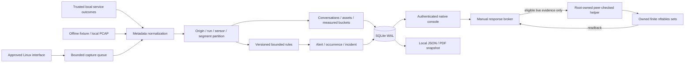

> **Historical phase record.** Phase-specific approval/publication constraints below describe that completed phase. Current public-source status, Apache-2.0 license and verification are recorded in [PUBLICATION](PUBLICATION.md) and the [README](../README.md). Installer Linux lifecycle acceptance remains pending.

# NetShield V2 completion and acceptance record

Local release candidate **2.0.0rc1**, originally 2026-10-04; Linux handoff/source hardening update 2026-10-05. See section 27 for current acceptance and installer status. Implemented and reviewed by one agent, without delegation. The final implementation instruction supersedes the earlier frontend-only phase; its approved visual identity and shell are preserved. This record distinguishes portable acceptance, operator-supplied controlled Linux acceptance, and the outstanding new-installer/ownership gates.

## 1. Executive summary

NetShield now has a working local investigation path: observation → normalized event → conversation → versioned finding → occurrence → incident → analyst decision → bounded SOC export. SQLite evidence persists across restart. The authenticated native console consumes real API V2 records rather than injected dashboard metrics. Twenty-five indicators and thirty-three offline scenarios exercise the actual parser and rule pipeline.

The unsafe shared V1 capture/web/firewall authority was replaced in the supported entry point. Management is unprivileged and loopback-only; capture and trusted service ingestion are separate processes; optional manual response crosses a narrow root-owned nftables helper boundary. Automatic response is rejected. Replay and isolated-lab evidence cannot invoke that host helper, including removal/reconciliation.

**Local portable acceptance: PASS. Controlled Linux runtime acceptance: PASS (operator supplied). GitHub publication: NOT READY.** Contributor/license rights and fresh Linux acceptance of the new installer remain open. See [Linux acceptance](LINUX-ACCEPTANCE.md) for the actual controlled environment and evidence. No live capture, generated network traffic or kernel firewall mutation was performed on this Windows workstation. No commit, push, publication or remote repository change was performed. Original root database and log bytes remain preserved.

## 2. Final architecture

Python, Flask, SQLite, Scapy and native ES modules remain; no React/FastAPI/PostgreSQL/Redis migration was necessary. Waitress serves the local console; ReportLab renders PDFs locally. Runtime packages are pinned. The wheel contains supported code and local browser assets, excluding the retired control modules.



See [architecture](ARCHITECTURE.md), [trust boundaries](THREAT-MODEL.md) and [installation](INSTALL.md). Root-owned executable/policy trees must remain separate from writable evidence. No privileged process is launched by the web server or replay quick start.

## 3. Files/modules added or substantially changed

There is no Git metadata in this checkout, so this is a source inventory rather than a claimed Git diff. A pre-change local ZIP preserves the prior state. The private publication manifest listed reviewed paths, sizes and SHA256 values; it is a temporary local QA artifact and is excluded from public Git tracking.

| Area | Main files |
|---|---|
| Supported backend | `netshield/settings.py`, `store.py`, `web.py`, `events.py`, `pipeline.py`, `capture.py`, `rules.py` |
| Investigation/response | `netshield/investigations.py`, `response.py`, `helper.py`, `locks.py`, `maintenance.py` |
| Validation/exports | `netshield/replay.py`, `lab.py`, `services.py`, `reports.py`, `__main__.py` |
| Console | `dashboard/templates/index.html`, `login.html`; `static/js/v2-console.mjs`, `ui.mjs`, `login.mjs`, `dashboard.js`; `static/css/dashboard.css`; local `icons.svg` and brand SVGs |
| Safe entry and retirement | `dashboard/app.py`, root `config.py`, retired `setup.sh` and five legacy attack scripts |
| Packaging/deployment | `pyproject.toml`, `setup.py`, pinned requirements, `.gitignore`, `config.example.json`, `deploy/*`, observe installers |
| Evidence/quality | eighteen Python test modules, three V2 browser scripts, authored fixture, benchmark/demo/publication scripts, prepared CI and issue/PR templates |
| Documentation | README, SECURITY, CONTRIBUTING, CHANGELOG; architecture/install/config/API/detections/scenarios/lab/response/report/threat-model/home-lab/benchmark/license documents; this completion record and UI milestone addendum |

Original V1 engine/API/browser modules remain local for provenance, outside the supported wheel/publication allowlist. Historical audit/plan documents are retained. Private environments, credentials, QA databases, caches and builds stay in ignored directories.

## 4. Database schema

Schema version is `PRAGMA user_version=2`. Seventeen versioned entities have stable IDs, typed indexed query fields and bounded JSON bodies: sensors, events, flows, metrics, rules, alerts, occurrences, incidents, incident_links, assets, bindings, actions, exceptions, protections, audit, lab_runs and settings. Three additional auth tables hold operators, hashed session tokens and login-rate records.

Common indexed fields include origin/run/sensor/event time, endpoints, protocol/rule/severity/status and related incident/alert/flow/asset IDs. Unique non-null keys support conversations, deduplication and response idempotency. Transactional application joins maintain evidence relationships; these entity references are not all SQL foreign keys. Auth sessions reference operators. Metadata records are capped at 256KiB.

WAL readers use separate connections; nested writer work shares an explicit `BEGIN IMMEDIATE` transaction. Migrations preserve legacy tables, back up populated databases and reject unknown/future/incomplete versioned schemas. SQLite backup plus integrity verification uses a new destination. Raw observation/flow/bucket retention defaults to seven days, evidence to ninety days, based on ingestion time; active actions survive pruning. Missing expired export evidence is disclosed.

## 5. Event/provenance model

Ingress assigns `capture`, `service_event`, `replay` or `isolated_lab`; callers cannot label uploaded events through a web injection endpoint. Events retain event time separately from ingestion time, literal endpoints, protocol/ports/length, sensor/interface/VLAN, run ID, bounded metadata and coverage flags. Replay keeps recorded time and isolates each run.

Rule clocks, state keys, conversations, asset observations and incident correlation include the origin/run/sensor/segment boundary. Late observations remain raw evidence but are excluded from rolling rule evaluation. No payload/password/session token/decrypted HTTPS retention is provided. Trusted outcomes enter through the local sshd journal adapter or a root-owned bounded web spool, not analyst-supplied "live" JSON.

## 6. Flow engine

Canonical bidirectional five-tuples collect first/last observation, duration, total/forward/reverse packets and bytes, interface/VLAN and alert links. First observation establishes display direction; a conversation is not an authenticated TCP session. A sixty-second default idle gap creates a new conversation. Flow state is persisted rather than held in an unbounded in-memory map.

Normalization supports IPv4/IPv6, TCP/UDP/ICMP, ARP and VLAN. Fragmented transport hints are excluded. Cleartext HTTP is counted only when a complete request is observable in a packet; stream reassembly and TLS inspection are absent. One-second traffic buckets contain measured packet/byte/occurrence totals. Gaps mean missing observations, not measured zero traffic.

## 7. Detection catalogue

All twenty-five implemented rules expose description, version, threshold/window/unit, severity, confidence, evidence, scope, benign causes and response eligibility. Findings are indicators. Qualified ATT&CK mappings are limited to T1046, T1110.001 and T1557.002 with stated rationale.

| Family | Implemented rules |
|---|---|
| Reconnaissance (4) | Vertical scan, horizontal service scan, ICMP discovery sweep, service enumeration |
| Availability (4) | SYN, UDP, ICMP and complete cleartext HTTP request rate indicators |
| Connections/authentication (3) | SSH connection attempts, trusted SSH failures, trusted web failures |
| Layer 2 (1) | Competing ARP IP/MAC claims within the same segment/window |
| DNS (5) | Query rate, long query, high-entropy label, distinct subdomain hashes, repeated newly observed parent |
| Behavior/egress (5) | Periodic connections, observed outbound byte volume, new external destination, unexpected outbound service, destination fan-out |
| Internal activity (2) | Internal host fan-out and repeated administration-service connections |
| Operations (1) | Trusted failed/stopped/stale/overflow coverage event |

The [full catalogue](DETECTIONS.md) gives exact defaults and IDs. State has bounded keys/windows, visible evictions/truncation and SYN retransmission deduplication. Typed administrative threshold/window/enabled overrides create archived/current rule versions; fresh replay adopts them immediately, while active capture/service consumers require a coordinated restart. Configured internal networks and approved outbound ports define local baselines; relevant observed evidence carries the evaluated baseline. First-seen baselines reset on consumer restart/eviction.

## 8. Incident model

Related findings group by observed source/target, sensor/interface/VLAN and origin/run within a 300-second activity gap. Each incident states its grouping rationale and retains alert links. This is explainable grouping, not proof that a device/person caused an attack.

Analysts can acknowledge/resolve, add attributed notes and detach an incorrectly linked alert with a reason. Detachment is audited and persists against automatic regrouping. The UI shows a real bounded occurrence timeline, evidence pivots and local exports. Severity, analyst status, indicator confidence and response state remain separate.

## 9. Asset model

Assets are observed addresses scoped to provenance/run/sensor/segment, with first/last seen and analyst labels. ARP replies supply observed address/MAC bindings; gateway Ethernet source addresses are not promoted into endpoint identity. Binding conflicts produce evidence.

No device fingerprint, OS, owner, process identity, vulnerability inventory or installed agent is invented. IPv6/privacy addresses and IP reuse remain separate observations; a physical host identity is not inferred.

## 10. Response architecture

Default response is observe-only; automatic-response configuration is refused. Manual enforcement requires an eligible capture/service-event alert without a replay/lab run, explicit reason, integer TTL 60–3600 seconds, local allowed CIDRs and infrastructure protections. Target-aggregated rate and ARP findings are deliberately ineligible for source blocking.

The broker persists REQUESTED/VALIDATED/APPLYING/APPLIED/FAILED/UNKNOWN/EXPIRING/REMOVING/REMOVED states, actor, alert/incident, expiry, verification and transition history. An interprocess lock and unique active target key prevent duplicate additions; active actions are capped at 250. Replay dry runs show VALIDATED/not_enforced and can be retired without helper access. Removal and reconciliation retain the same provenance gate.

The optional root helper validates Unix peer UID, root-owned policy/runtime/code and canonical IP/finite TTL, then uses fixed argument arrays/stdin. It owns only the marked `inet netshield_v2` table, finite IPv4/IPv6 sets and exact source-drop input/forward hooks; foreign or changed objects are refused. Independent root policy protects local IPs, gateways, resolvers and operator-selected jump hosts. Kernel readback must show presence/absence; malformed replies, command failure or helper loss cannot become success. Presence alone does not prove packet-path mitigation.

Windows tests verify authority, concurrency, expiry/removal and failure contracts using explicit doubles. **Controlled Linux host/namespace acceptance is now operator supplied and recorded separately; these checks were not rerun on this Windows workstation.** See [response acceptance boundary](RESPONSE.md).

## 11. Attack Lab architecture

Browser Attack Lab executes only fixed offline scenarios. Review and confirmation precede execution. Category/expected rule/budget/mode/safety, generated/processed observations, detected occurrences, elapsed time, assertions, expected/observed rules, provenance and evidence pivots are backed by retained run records. No arbitrary target, URL, shell, password list or injected successful alert exists.

Replay is bounded to one job per local runner, 120 seconds, cancellation between observations, fresh rule/run state and fixture SHA256. PASS means expected detector assertions were observed; benign controls assert no findings. Additional findings remain visible. Failed expectations are FAIL; cancellation/error is INCOMPLETE. Local PCAP import is CLI-only, ≤20MiB/5000 packets/120 seconds, and reports COMPLETE without external assertions.

The additional CLI-only Linux runner requires explicit authorization and Linux root on a dedicated owned VM. It creates only fresh named unrouted namespaces/veth/service, fixes addresses/ports/rates, captures real packets, tests only namespace firewall state/TTL/connectivity, resolves the incident, exports the report and cleans owned resources. It never calls the host helper. Failure/Ctrl+C/SIGTERM paths attempt bounded cleanup and record remaining resources; host crash/SIGKILL cannot guarantee cleanup. See [Attack Lab](ATTACK-LAB.md).

## 12. Scenario catalogue

**33 offline scenarios passed** in tests and in the clean installed package. The [scenario catalogue](SCENARIOS.md) lists exact IDs, categories, budgets and expected rules. They cover scan/discovery/IPv6, rate tests, SSH connection versus outcome evidence, web outcomes, ARP, five DNS indicators, periodic behavior, egress, internal SMB/RDP-style metadata and operations. Four benign/control scenarios check restrained outcomes. Service-failure scenarios are authored outcomes, not live credential guessing or deliberately crashing the running sensor/helper.

The optional `owned-namespace-scan` has operator-reported PASS on the accepted Linux VM, separately from host-helper acceptance: eighteen fixed connections, ≤20 attempts/s, ≤300 packets/five-second capture, sixty-second namespace block and a 120-second overall budget. No Windows result is presented as its PASS.

## 13. SOC reporting

Authenticated incident JSON/PDF exports snapshot linked evidence transactionally. They include executive assessment, timestamps/endpoints/sensor/run, rule versions/observed values/thresholds, qualified ATT&CK rationale, timeline/conversations, analyst notes, response actor/authority/scope/expiry/verification, disposition, observed indicators, recommendations and coverage/template limits. Text is escaped; rendering is local and requires no remote service.

Budgets: up to 128 linked alerts, 100 occurrences per alert, 100 flows/actions, and the latest 100 PDF timeline rows; truncation/missing retained evidence is disclosed. JSON is deterministic for a fixed snapshot/generation time. PDFs contain rendering metadata and are not signed forensic records. Resolution is not automatically classified as false positive or compromise.

The final [three-page replay report](assets/v2-final/flagship-replay.pdf) and [JSON](assets/v2-final/flagship-replay.json) describe actual retained evidence and a retired dry run. All three rendered pages were inspected. IDM intercepted browser downloads; matching NetShield files were located in `Downloads/Documents`. The latest copied [sample](assets/v2-final/sample-replay-incident.pdf) and both rendered pages were inspected. Authenticated HTTP status/content/PDF bytes are also checked independently.

## 14. Authentication/security controls

No default account/password: bootstrap through local getpass CLI. Passwords use scrypt; username/role/password inputs are bounded. Opaque session tokens are hashed in SQLite, expire after eight hours, rotate at login and revoke on logout. Cookies are HttpOnly/SameSite Strict; Secure/HSTS apply with explicit TLS configuration. Login has an expiring nonce and ten-attempt/five-minute budget. Viewer reads; operator investigates/replays/manual response; admin additionally tunes rules/retention/protections.

API mutations require CSRF, permitted Origin and role. Host validation applies before auth shortcuts. Management bind is loopback; remote use requires an explicit TLS proxy/tunnel. CSP permits local assets; telemetry uses safe text nodes. Literal parameterized queries, 16KiB request bodies, resource limits and sanitized error responses constrain management input. Legacy API handlers are unregistered; the retired socket surface returns 410. Trusting a configured local producer/code administrator does not make user-uploaded evidence live.

## 15. Home Lab topology

Replay needs only an unprivileged Python installation. The minimal live gate needs one owned Linux VM containing two temporary namespaces, a fixed 10.77.0.2 generator and 10.77.0.10 victim with disposable TCP9090 service, without default routes/NAT/public bridging.

A larger home lab can place the sensor at an authorized TAP/mirror or routed gateway with isolated Linux/optional Windows victims. An ordinary endpoint cannot see every switched conversation; a mirror cannot enforce a remote path. Input/forward nft hooks affect only traffic traversing that host/namespace. Keep management on a separate protected reachable path. No VM/OS installation or Docker Desktop privileged networking was performed. [Topology and coverage guide](HOME-LAB.md).

## 16. API V2

The [API reference](API.md) describes authenticated resources for events/flows/metrics/alerts/occurrences/incidents/links/assets/bindings/rules/actions/exceptions/protections/audit/runs/sensors, plus status/overview/scenarios/settings/rule configuration. Collections expose items/total/limit/offset/schema version, literal search and typed time/origin/run/endpoint/protocol/port/rule/severity/status/relationship filters. Unknown filters and malformed values are rejected; UI uses fifty rows, API caps at 250.

Mutations support investigation state/notes, asset labels, incident detach, scoped expiring exceptions/revocation, administrator response protections/removal, manual response/removal/reconciliation, fixed scenario runs/cancel, retention and typed rule overrides. Incident evidence/export endpoints expose bounded consistent snapshots. Rule statistics count retained alerts for the exact version across all origins, explicitly broader than the shared traffic filter. No arbitrary query language, event upload or attack-command endpoint is provided.

## 17. UI final state

Ten implemented screens: Overview, Traffic, Alerts, Incidents, Assets, Detections, Response, Attack Lab, Health and Settings. Global alert search, shared range/origin/run selection, literal endpoint/protocol filters, pagination, evidence pivots and contextual actions connect them. Health separates capture state from replay, reports heartbeat/queue/parser/writer/state pressure and leaves kernel loss unknown. Integrations are disclosed as unavailable in Settings rather than presented as a fake screen.

Approved identity: a geometric N of packet rails joined across a boundary, with icon/monochrome/lockup SVGs and local consistent icons. The design system uses graphite `#181c1f`, sidebar `#111518`, charcoal `#202529`, teal `#57c9bd`, semantic green/amber/red/blue, 4px spacing increments, 4–6px radius, sans-serif UI and technical monospace. Borders, dense tables and quiet surfaces establish hierarchy. Focus outlines, skip link, labelled controls, native dialog focus/Escape, deliberate table scrolling and reduced-motion treatment remain.

Final polish fixes table empty cells, compact phone scenario pagination, meaningless metadata rows, stale health badges, async drawer reopening and chart gap semantics. A single observed bucket shows measured values without inventing a trend. Loading/empty/no-results/offline/stale/API errors and stopped capture avoid "system secure" claims. [UI implementation record](UI-V2-IMPLEMENTATION.md).

## 18. Test results

2026-10-04 portable suite (historical): **102 passed, 1 skipped, 0 failed in 83.55s**, Python 3.14.6 on Windows. The skipped test requires explicit owned Linux VM kernel authorization. Ruff check and format check passed for the supported backend/scripts/Python tests/entry point; final verification also covers setup.py. Active JS modules pass Node syntax checks. Prepared hosted CI has not been run.

Coverage includes migration/restart/backup and rollback, parsing/flows/IPv6/VLAN/fragments, positive/negative/boundary thresholds and late/retransmitted packets, origin/segment/run isolation, bounded state/intake/writer rollback, trusted producers, auth/CSRF/Origin/Host/roles/session lifecycle, scoped suppression/protection, incident detach, escaped bounded exports, response readback/malformed replies/nonzero commands/concurrency/reconciliation and owned-resource cleanup on failure/cancel. The thirty-three scenarios use real pipeline evaluation, with no host networking authority.

Browser matrix: **50/50** screen/viewport checks passed, no script errors or document/non-table clipping. Real workflow passed scenario confirmation/result, destination-port filter, acknowledgment/note, inert malicious text, dry-run/removal, incident timeline, PDF, detection detail and mobile keyboard navigation. Separate delayed-transport QA passed loading/stale behavior without replacing response contents. Raw matrix/workflow/state/install/preservation QA manifests remain local and excluded from public Git tracking. Curated screenshots and example reports are retained as documentation evidence.

These are author-run local checks, not an independent penetration test, live Linux acceptance or remote CI result.

## 19. Benchmark results

Actual [benchmark JSON](assets/v2-final/benchmark.json), Windows/Python 3.14.6, Intel64 Family 6 Model 141, generated 2026-10-04T19:06:12Z:

| Offline phase | Samples | Measured result |
|---|---:|---:|
| Scapy decode + normalization | 2,000 | 2,016.36 observations/s |
| Benign rule evaluation | 2,000 | 42,287.14 observations/s |
| Rule state pressure | 2,000 | 9,698.62 observations/s |
| Pipeline + per-packet SQLite commit | 500 | 50.27 observations/s |
| Pipeline + sixteen ≤32-packet transactions | 500 | 422.77 observations/s |
| Authenticated in-process flow API | 20 | median 5.456ms; p95 7.388ms |
| Authenticated in-process overview API | 20 | median 6.522ms; p95 7.790ms |
| Authenticated in-process alert API | 20 | median 3.553ms; p95 3.907ms |

Database+WAL after 500 packets: 1,703,936 bytes. Rule-pressure traced allocation peak: 5,017,224 bytes; bounded state evicted 1,905 keys. Queue stress offered 260 observations to capacity 128: 128 retained, 132 visibly rejected. Traced allocations exclude full process RSS/native libraries.

These are one-run offline measurements, not sustainable link capacity, zero-loss capture or network latency. Batch measurement exposes storage amortization without promising production PPS. [Bounds and reproduction](BENCHMARKS.md).

## 20. Screenshots

Saved actual replay views for every screen at 1920×1080, 1440×900, 1024×900, 390×844 and 320×740. Full-page captures can be taller than the viewport; drawers are captured at the actual viewport. Representative desktop/tablet/phone screenshots and final drawer/report pages were opened and visually inspected. Tables intentionally scroll inside their container; the document does not overflow.

| View | Evidence |
|---|---|
| Overview | [1920](assets/v2-final/overview-1920.png), [1440](assets/v2-final/overview-1440.png) |
| Traffic / tablet alerts | [filtered traffic](assets/v2-final/traffic-filter-1440.png), [1024 alerts](assets/v2-final/alerts-1024.png) |
| Investigations | [alert](assets/v2-final/alert-evidence-1440.png), [incident timeline](assets/v2-final/incident-timeline-1440.png), [rule](assets/v2-final/detection-detail-1440.png) |
| Response | [center](assets/v2-final/response-1440.png), [dry-run evidence](assets/v2-final/response-dry-run-1440.png) |
| Attack Lab | [library](assets/v2-final/lab-1440.png), [result](assets/v2-final/lab-result-1440.png), [390 phone](assets/v2-final/lab-390.png) |
| Narrow phone | [320 alert](assets/v2-final/alert-evidence-320.png), [navigation](assets/v2-final/navigation-320.png), [settings](assets/v2-final/settings-320.png) |
| Coverage / transport states | [health](assets/v2-final/health-1440.png), [loading](assets/v2-final/loading-390.png), [stale](assets/v2-final/stale-390.png), [offline](assets/v2-final/disconnected-390.png), [no results](assets/v2-final/no-results-390.png) |
| SOC report | [page 1](assets/v2-final/flagship-report-page-1.png), [page 2](assets/v2-final/flagship-report-page-2.png), [page 3](assets/v2-final/flagship-report-page-3.png) |

UI screenshots show a browser investigation run; the resolved flagship report is a separate actual CLI demo run, with explicit IDs/provenance. These artifacts are not represented as the same single recording. No live dashboard/enforcement screenshot is fabricated. A future GIF can record the real scenario → drawer → dry-run → export interaction.

## 21. Demo walkthrough

From an installed source environment, with a new report output directory:

```sh
python scripts/replay_demo.py --data data --output reports/demo-1
```

Latest actual result: **PASS**, eighteen offline packets, rules NS-RECON-ENUM and NS-RECON-VERTICAL, thirteen occurrences in two alerts, one correlated incident; all linked alerts and the incident resolved after attributed validation notes. A sixty-second manual dry-run decision was retired: REMOVED / not_enforced. JSON and three-page PDF were generated. [Result record](assets/v2-final/flagship-result.json).

Run `5903caf4-875a-42d5-99b1-b25cd1e99bf3`; incident `92d0839a-835c-44ee-81c1-423404c1eec5`. Recorded packet time is 2023-11-14; analyst/generation time is 2026-10-04. Neither time is rewritten to pretend recent live traffic.

The separate owned Linux closed-loop command and opt-in test have operator-reported PASS; they were **not rerun on this Windows workstation**. They require real capture → scan finding → namespace-only presence/unreachable → TTL absence/reachable → resolution/report → owned cleanup, with unchanged unrelated host rules. The host helper remains a separate acceptance boundary. [Thirteen end-to-end scenario walkthroughs](DEMO-SCENARIOS.md) define trigger, evidence, UI, actions and final state without implying all are live runs.

## 22. Installation verification

Built wheel `netshield_ndr-2.0.0rc1-py3-none-any.whl`, SHA256 `4d13eabb2eebcdd7b5381ec4f133dceced6c48b5e3982fc29b291b8ed3ed6fea`. Verified packaged source/active JS/CSS byte parity and absence of retired API/model/browser controls.

A fresh private virtual environment installed exact runtime dependencies; the final wheel was installed into it and `pip check` passed. Executing from outside the checkout with PYTHONPATH cleared proved installed imports, all thirty-three actual scenario PASS results, unauthenticated API denial, local asset serving, PDF generation, verified SQLite backup, evidence reload and an installed Waitress login page/server lifecycle. Re-running init preserved records. The raw install QA manifest remains local; see the current [publication verification](PUBLICATION.md).

No Linux service/privileged install was attempted. Observe installers refuse existing environments and make no OS/firewall changes. [Install/backup/upgrade/restore/uninstall procedure](INSTALL.md) uses separate new environments/data paths and explicitly scoped owned cleanup.

## 23. Known limitations

- One-host SQLite/Python appliance; retention must manage disk. No distributed sensors, sustained production capacity or kernel packet-loss guarantee.
- No TCP stream reassembly, TLS/decrypted HTTPS, encrypted DNS visibility, process identity or remote agent. Whole-packet cleartext HTTP counting is deliberately narrow.
- Behavioral first-seen state resets on restart/eviction. DNS parent grouping uses two labels, not a public-suffix registry. Rolling clocks/state advance before DB commit; writer failure stops intake, but uncommitted observations are not recoverable by replaying volatile state.
- Rule edits require coordinated live-consumer restart; catalogue statistics explicitly span retained origins. Replay concurrency is local-runner scoped, and a crash can leave a RUNNING record requiring operator review; no distributed job recovery.
- Trusted web spool re-import can duplicate observations; producer IDs/rotation and continuous producer health are future work. SSH adapter covers its supported root sshd failed-password journal format rather than every PAM/authentication outcome.
- Incident grouping is endpoint/time evidence, not identity/causality. Alerts can recur after analyst resolution; false-positive classification remains attributed notes plus scoped expiring exceptions.
- Finite evidence/page/export budgets can truncate history. Audit is available through API and exports, without a dedicated audit screen. MFA, user recovery UI, webhook/Syslog delivery and remote integrations are absent.
- Prepared CI/version/service matrix has not run remotely. Current local portable checks use Python 3.14.6/Windows; operator-supplied controlled Linux acceptance used Python 3.12.15/Ubuntu 22.04.5. New installer execution is pending.

## 24. Security limitations

Local root, code deployment administrator and trusted service producers are outside the containment model. A compromised authorized management service can request actions inside root-approved scope; independent jump-host protections are essential. Root must never execute netshield-writable package/code/config. Windows chmod is not a full Windows ACL deployment policy.

Metadata may contain sensitive IP/MAC identifiers even without payloads. Local DB ownership can alter records; exports are unsigned and no tamper-proof forensic chain is claimed. Capture parsing/Scapy is not a hardened hostile high-throughput sensor. Spoofed source IPs, placement gaps and benign automation can cause indicators, so no automatic blocking policy is enabled.

Kernel presence is narrower than restored/blocked connectivity; owned namespace acceptance cannot certify host helper placement. Actual nftables/systemd/Unix credentials and finite host enforcement were accepted in the supplied controlled Linux run; general firewall coexistence and the new installer remain bounded by separate evidence. Lab SIGKILL/host crash can leave generated resources; inspect exact recorded names rather than sweeping unrelated state. The final gate did not transmit traffic or apply a real block here.

## 25. Remaining optional future improvements

After the acceptance/ownership gates, prioritize measured sensor/storage pressure and durable producer/replay recovery over extra dashboard widgets. Useful bounded additions include structured analyst disposition, audit search screen, producer event IDs/heartbeats, persistent configurable baselines and an explicitly reviewed public-suffix dependency. Signed exports, remote sensor transport, MFA and queued Syslog/webhook delivery need separate threat models and evidence; none is required to make the current offline demonstration real.

Keep Python/Flask/SQLite and native console until measured contention or product requirements justify migration. Add live authentication validation only through fixed disposable owned services; retain offline review without privileges.

## 26. Exact GitHub publication checklist

**NOT READY; the following is a checklist for Yousef's review, not performed Git actions.** Target repository: `YousefE1bana/Net-Shield`.

- [x] Source-backed audit/plan retained; current supported capability/limits documented; approved UI identity preserved.
- [x] Portable suite, all thirty-three replay scenarios, clean wheel install/restart/PDF/backup, browser workflow and fifty viewport checks passed.
- [x] Real permissioned replay screenshots/report/fixture prepared; no private production capture or successful live block invented.
- [x] Original database/log preserved; generated DB/log/cache/build/environments/credentials excluded from the curated publication candidates.
- [x] Default-off manual authority, replay host-helper denial, bounded lab and responsible-use instructions documented.
- [x] README, architecture, quick start, config/API/detection/scenario guides, threat/security model, CONTRIBUTING, changelog and prepared CI/templates exist.
- [ ] Yousef verifies original contributor/institution rights and selects the actual license/copyright holders. Review dependency/asset redistribution and notices; then add approved LICENSE, required notices and matching package metadata. The Apache-2.0 recommendation is not a license grant.
- [x] Operator-supplied dedicated owned Linux VM acceptance reports the explicit namespace kernel test PASS; prior reproduction command (`sudo env NETSHIELD_LINUX_TESTS=1 /opt/netshield/venv/bin/python -m pytest tests/test_linux_lab.py -m linux` from the source checkout). Retain real presence/absence/connectivity/TTL/cleanup and unrelated-host-policy evidence.
- [x] Operator supplied controlled live capture, service privilege/Unix peer boundaries, actual host enforcement/expiry/reconciliation and management ACL acceptance. Storage pressure, broad outage recovery and new installer lifecycle coverage remain unclaimed. Preserve unrelated rules; never use Docker Desktop's managed kernel.
- [ ] After any fixes, rebuild/recheck the wheel, rerun relevant tests and refresh evidence/capability labels. Hosted offline CI must pass on the supported matrix before version-support claims.
- [ ] Run `python scripts/publication_check.py`, inspect every manifest candidate and sanitized fixture/report/screenshot, and verify credentials/private artifacts are absent. Pattern hygiene is not a guarantee or Git tracking proof.
- [ ] Only after explicit later authorization, initialize/use Git, stage reviewed manifest paths explicitly, inspect the staged diff/status and confirm original V1/generated/private files are absent. Do not use blanket staging of this workspace.
- [ ] Yousef reviews the exact staged source, ownership/license notices, actual Linux evidence and release wording before authorizing a final commit/push/release. This implementation has done none of those actions.

Implementation stops here for review. The optional future features are not begun, and the external publication gates remain explicit.

## 27. Linux deployment hardening update — 2026-10-05

The operator-supplied Ubuntu 22.04.5 LTS / Python 3.12.15 / nftables 1.0.2 acceptance reports **104 passed, 1 skipped**, explicit namespace closed-loop PASS, real cross-VM scan detection PASS and manual host response PASS. Kernel drop evidence: **56 packets / 4704 bytes**; ping **112 transmitted / 56 received / 50% loss**. Finite 60s expiry restored connectivity, and maintenance reconciled **REMOVED / kernel_absent**; status **0/SUCCESS**, timer active. Windows management was allowed; Kali HTTPS returned **403**. Backend stayed **127.0.0.1:8080** behind selected-IP TLS. Socket filesystem and independent Unix-peer restrictions were exercised. [Unaltered screenshots, attribution and limits](LINUX-ACCEPTANCE.md). This controlled VMware home lab is not production-enterprise certification.

Additional hardening: isolated Python service imports and fresh packaging build directories prevent writable-CWD imports and stale retired modules in wheels. Source fixes ported: nftables 1.0.x absent-JSON-comment fallback using an exact table-level text marker (strict schema checks retained), preservation of text stdout in both nft runners, and AF_NETLINK for web/maintenance with empty capabilities. New regressions refuse wrong/nested/substring/foreign markers and contradictory explicit JSON comments.

The new root-level `install.sh` / `scripts/linux_install.py` automates explicit network choices, compatible Python/venv selection, optional explicitly authorized Jammy PPA, wheel-based root-owned production runtime, dynamic nologin account, coordinated protections, private state, secure operator bootstrap, six reviewed units, dedicated selected-IP Nginx/TLS/ACL, certificate reuse, managed-file ownership/hash guards, retained backups/previous runtime and post-install verification. [Canonical installer guide](LINUX-INSTALL.md). No attacks, automatic blocking, foreign site edits, forwarding/network changes, firewall flushes, data purges or silent manual-deployment adoption.

Current Windows source suite after these changes: **122 passed, 1 skipped in 58.86s**, Python 3.14.6. This is 102 prior portable tests plus eight nft compatibility regression cases and twelve installer cases; it is not a rerun of the VM's historical 104-test suite. OpenSSL certificate SAN/key/identity tests used real local OpenSSL; systemd/nft/apt actions remain unexecuted here. See [hardening report](LINUX-RELEASE-HARDENING.md) for final command/build/hygiene results.

**Remaining gates:** run the newly created installer on a fresh owned Ubuntu VM (first install, rerun, verify-only, failure paths, real listeners/permissions/ACL); resolve original contributor/institution/license rights; review screenshots/candidates and hosted CI. Existing accepted manual deployment is preserved and refused by the installer without its ledger. No new Linux runtime execution, Git initialization, commit, push, tag, release or remote deployment occurred in this phase.
