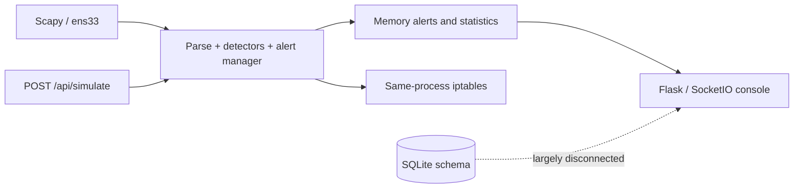
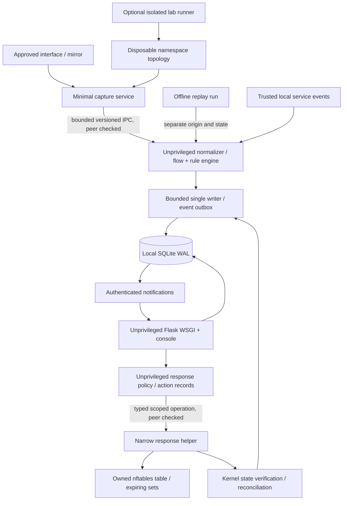

> **Historical phase record.** Phase-specific approval/publication constraints below describe that completed phase. Current public-source status, Apache-2.0 license and verification are recorded in [PUBLICATION](PUBLICATION.md) and the [README](../README.md). Installer Linux lifecycle acceptance remains pending.

# NetShield V2 — Product, Architecture and Delivery Plan

**Date:** 2026-10-03. **Status:** proposal for Yousef's review; implementation is not authorized by this document. **Source baseline:** [NETSHIELD-CURRENT-STATE.md](NETSHIELD-CURRENT-STATE.md). **Future repository:** `YousefE1bana/Net-Shield`; untouched in this phase.

Everything described as V2 below is proposed, not an existing capability. Current-state observations were verified from source and safe mocked/loopback probes. No product code, firewall or real traffic generator was modified or executed as part of this plan.

## 1. Executive summary

Build NetShield as a **single-host Linux NDR and lightweight SOC appliance for small, explicitly scoped networks**, with a portable offline replay experience. Its distinguishing feature should be a reproducible evidence chain: observed traffic or trusted service events → explainable detection → analyst investigation → bounded, verified response → recorded outcome.

Keep Python, Flask and SQLite. They fit the target and minimize installation burden. Keep Scapy initially for normalization and controlled capture, subject to a measured capacity envelope. Rebuild the privilege boundary, durable event pipeline, detector semantics and response adapter. Redesign the custom console around dense accessible tables, real time buckets, provenance, coverage and evidence.

Ship observation and replay first. Ship real enforcement only after isolated Linux tests prove scope, idempotency, expiry and rollback. Default to **observe-only**, authenticated management, automatic response off and live Attack Lab off. Demonstrations must produce their own expected evidence; they must never pre-inject an alert and claim real detection.

Success is a fresh operator reproducing a safe demo, understanding why a rule fired, seeing what the sensor could observe, verifying what the firewall actually did, and recovering from a failure. A larger feature list or a fashionable stack does not establish that success.

### Intended envelope and explicit limits

- Initial deployment: one Linux host, one local database, one sensor and a small operator team. No distributed collector, multi-tenant SaaS or high-throughput line-rate claim.
- Modes: replay without raw privileges; passive sensor; host protection; explicitly configured gateway protection. Only the last two can enforce traffic traversing the managed firewall.
- SSH/HTTPS authentication outcomes require trusted service-log/event adapters. Passive encrypted packets do not reveal failed credentials.
- ARP binding anomalies and SYN rates are indicators, not verified attacker identity. They do not independently authorize automatic source-IP blocking.
- Throughput, retention and hardware recommendations must come from repeatable benchmarks before release. Do not invent a packets-per-second guarantee.

## 2. Current architecture

The current app combines a Scapy callback, four heuristic detector objects, in-memory alerts, in-memory iptables blocks and Flask/SocketIO in one process. The documented entry point uses sudo and an all-interface management listener. SQLite schemas exist but operational writers are disconnected. The frontend is a custom Jinja/vanilla-JS page with external Chart.js/Socket.IO dependencies. The Attack Center generates real traffic separately while reporting synthetic events to the same live response pipeline.



The factual file inventory, routes, detector branches, safe-probe results and limits are in the current-state audit. This plan does not treat documented container/cloud examples as implemented deployments.

## 3. Current feature matrix

| Current feature | Actual state | V2 disposition |
|---|---|---|
| Python packet parsing/capture | Real implementation, live deployment unverified; IPv6/context/health gaps | IMPROVE normalization; REBUILD lifecycle and delivery boundary |
| SYN/HTTP/UDP thresholds | Trigger in probes; units and attribution misleading | IMPROVE, split accurate rule semantics |
| SSH/HTTP brute-force labels | Connection/POST counts, no failed authentication | REBUILD labels and evidence; NEW trusted auth-event adapter |
| Port scan | Distinct ports work; target/window/SYN-ACK bugs | IMPROVE vertical/horizontal scan rules |
| ARP/SSL detector | Binding changes present; TLS/redirect logic incorrect | REBUILD as honest ARP/TLS policy indicators |
| Alerts | Real memory deque/dedup, no durable lifecycle | REBUILD durable occurrences and investigation |
| SQLite | WAL/schema helpers, runtime persistence unwired | KEEP engine; REBUILD schema and write integration |
| iptables blocking | Real argv adapter; failure/lifecycle/race defects | REBUILD response service; prefer scoped nftables backend |
| Dashboard | Renders; misleading state and charts, unsafe DOM | REBUILD interaction/data semantics; KEEP custom identity |
| Attack scripts | Real local tools, advisory-only containment; synthetic pre-reporting | REBUILD scenario harness; replay first |
| Deployment docs | Partial setup; prose-only production options | REBUILD reproducible supported installation |
| Tests/CI/license | Missing | NEW before public release |

## 4. Bugs, risks and technical debt

### Release-blocking safety and trust defects

The current audit's NS-S1–NS-S8 cover unauthenticated controls, unvalidated source selectors, unsafe HTML rendering, synthetic/spoofed response authority, false firewall success, unbounded state, duplicate-rule races and lost expiry/ownership. P0 corrections must precede enabling V2 enforcement or a remotely reachable management service.

Root web execution should be removed structurally; putting login in front of the existing root monolith is insufficient. Typed input validation belongs both in the API and independently in the privileged response boundary. UI protection is required even after adding authentication because security telemetry itself is untrusted.

### Detection/data defects

Fix count-versus-rate units, protocol case handling, SYN-ACK attribution, mixed target counters, wall-clock versus event time, IPv6 identity, incorrect TLS first-byte checks and missing normal redirect context. Introduce durable, bounded occurrences rather than discarding duplicate evidence. Replace “secure” with accurate capture/freshness/coverage state. Stop calling TCP connection attempts failed passwords or network anomalies confirmed DDoS/MITM.

### Operational debt

Move packet intake away from subprocess/web/database work; bound memory and queue sizes; own worker lifecycle; expose loss/health; add migrations and retention. Resolve configuration precedence, environment mismatch, missing packaging/service files and excessive setup host mutation. Bundle frontend assets, remove unused dependencies, pin and test supported runtimes, and make errors visible. Preserve useful modules and interfaces only after their contracts are tested.

## 5. Missing capabilities

The smallest useful V2 needs durable events and alerts, an investigation detail view, traffic/flow metadata with correct time buckets, sensor health, explicit rule configuration, protected allowlists, verified action history and reproducible offline scenarios. These capabilities support existing NetShield concepts rather than adding unrelated cybersecurity products.

Incidents, assets and trusted authentication events come next because they make evidence more useful. Export and one integration pathway follow a reliable event contract. Multi-sensor orchestration, rich packet decoding, threat-intelligence feeds, machine-learning scoring, inline IPS, enterprise SSO and complex orchestration are deferred until a demonstrated user need justifies their cost.

## 6. Proposed V2 product

| Major feature | Classification | Why / bounded scope |
|---|---|---|
| Network Overview | REBUILD | Replace cumulative/session charts with real rate buckets, coverage, top talkers and linked alert trends |
| Live capture | IMPROVE | Preserve Scapy investment; isolate capture, surface readiness/loss and state an evidence-backed capacity envelope |
| Traffic / flow explorer | NEW | Five-tuple conversations, byte/packet counts, interfaces, time/protocol filters and alert links; no invented application/OS intelligence |
| Alerts and lifecycle | REBUILD | Durable findings, repeated occurrences, acknowledgment/resolution and evidence drawers are core SOC work |
| Explainable incidents | NEW | Group related alerts into time-bounded episodes with visible rationale; no opaque risk score or guessed causality |
| Observed assets/hosts | NEW | First/last seen, IP/MAC/interface/VLAN/service observations and linked evidence; label incomplete identity/NAT conflicts |
| Detection Rules | IMPROVE | Versioned typed rule config, scopes, counters, confidence, tuning and replay tests; no arbitrary Python upload |
| Response Center | REBUILD | Manual default, policy gates, finite expiry, verified kernel state, rollback and durable audit |
| Allowlist/tuning workflow | NEW | Scoped reasoned exceptions with owner, expiry and audit; distinguish suppressing alerts from protecting hosts against response |
| Evidence/timeline/export | NEW | Join events, alerts, actions and actor decisions; sanitized JSON/CSV first, optional bounded PCAP references |
| PCAP replay | NEW | Deterministic validation through the real parser/rules; isolated provenance and dry-run response |
| Bounded PCAP capture | OPTIONAL | Opt-in size/time budget, access controls and redaction guidance; metadata-first default protects privacy/storage |
| Attack Lab | REBUILD | Replay plus reusable restricted scenarios with expected-result assertions; separate privileged isolated live runner later |
| Sensor/System Health | NEW | Readiness, heartbeat, interface, queue/drop, writer, disk, helper and transport freshness; no fabricated traffic assurance |
| Audit log | NEW | Durable actor/action/config records; application-append-only is not cryptographic tamper-proof storage |
| JSON webhook / Syslog | OPTIONAL | Useful export to an existing SOC; one documented adapter after outbox/retry/security contract |
| Multi-sensor / Zeek / Suricata inputs | OPTIONAL | Extend measured requirements; adapters avoid pretending to implement full L7 protocol analysis |

Product modes must remain visible in the header and data rows: **Live**, **Replay**, **Lab**, **Degraded**. A replay result may exercise a simulated response state machine, but it must never display “kernel block applied” or alter the live firewall.

## 7. UI information architecture

### Navigation

Group pages by operational intent, not by a collection of equally prominent dashboard tiles:

```text
Overview
Investigate: Traffic · Alerts · Incidents · Assets
Operate: Detections · Response
Validate: Attack Lab
Administration: System Health · Settings
Integrations: administration subpage until integrations are implemented
```

All proposed minimum screens survive with purpose, but Integrations does not need an empty top-level destination. System Health is also reachable from a persistent health indicator. Attack Lab is visible as replay-capable; live controls appear only when an isolated runner is configured. Incidents/Assets navigation becomes enabled when those models ship, rather than displaying invented records.

### Shared console shell

Left navigation, compact product/sensor identity, mode badge, global search, shared time-range selector with absolute/relative UTC-aware display, live/pause control, data freshness and user menu. Show affected sensor and enforcement placement, not just an IP. Keep filter/time state in the URL so an investigation can be bookmarked and reproduced. A permission-limited user sees read-only behavior; the backend independently enforces permissions.

Use neutral charcoal/navy surfaces, restrained borders, one cool accent, readable sans typography and monospace for addresses/technical values. Severity uses color **and** label/icon; alert status is distinct from severity; action verification status is distinct from both. Aim for 13–14px table text with comfortable row density, meaningful spacing and visible focus. No glow, huge metric cards or fake activity animations.

### Screen contracts

| Screen | Primary question and content | Main drill-down/action |
|---|---|---|
| Overview | What changed in this time range, and is observation reliable? Compact captured rate/bytes, alert trend, unresolved severity, top conversations, protocol mix, coverage/health notices | Every number filters a real query; hover/brush chart time range; no overall SAFE verdict |
| Traffic Explorer | Which observed conversations explain this event? Server-filtered table: first/last time, sensor, source/destination, transport/application, packets/bytes, duration, associated alerts | Flow drawer with direction, evidence and capture gaps; pivot IP/service/time into alerts/assets |
| Alerts | Which findings need review? Time/severity/confidence/rule/source/target/occurrences/status/incident columns | Detail URL/drawer: why fired, observed versus threshold, rule version, provenance, evidence timeline, related flows; acknowledge/resolve/add reason |
| Incidents | Which related alerts form a reviewable episode? Status, affected hosts, first/last activity, alert count and grouping rationale | Timeline, analyst notes, linked response; detach wrongly grouped alert with audit |
| Assets | What identities were actually observed? First/last seen, segment, observed addresses/MACs, services and coverage | Host detail with alias history/conflict, flows/alerts; analyst labels distinct from sensor facts |
| Detections | What is enabled and why? Rule ID/version/scope/unit/window/threshold/confidence/response eligibility and replay result | Edit validated config with diff, test against benign/positive fixtures, publish version; no arbitrary executable rule text |
| Response Center | What enforcement was requested and what actually happened? Active actions, requested/applied/failed/unknown state, scope, origin, owner, expiry and history | Preview protected-scope checks and topology; temporary block, retry failed removal, verified unblock, policy/allowlist tabs |
| Attack Lab | Can the pipeline reproduce expected outcomes safely? Scenario inventory, topology, budget, fixture version and previous runs | Run replay; inspect expected/observed assertions and evidence links. Isolated live run requires validated runner and explicit confirmation |
| System Health | Can I trust collection, storage and response? Components/readiness/heartbeat, interface, queues/drop availability, writer lag, disk and helper reconciliation | Diagnose real errors, view bounded logs, select interface only through validated config; distinguish quiet traffic from dead sensor |
| Settings | What is the effective configuration? Sensor placement, users/permissions, retention/privacy, networking and protected infrastructure | Typed forms, validation, effective value/source display, audited changes; secrets write-only |
| Integrations | Where will data leave the host? Implemented destinations, delivery health/retries and credential state | Redacted test event, constrained destination setup, retry history; no placeholder connected status |

### Table and investigation UX

Use semantic HTML tables, explicit headers, stable sorting, server pagination/cursors, selected columns, applied filter chips and query counts. Begin with structured filters (`src`, `dst`, `port`, `protocol`, `rule`, `severity`, `status`, `sensor`, `origin`, `time`) rather than an unsupported Splunk-like language. Selection scope must say “these rows” versus “all matching”; bulk destructive response is deferred. Related evidence can open a drawer while retaining the table context and a shareable detail route.

Pause live insertion during review and show a “new results” count; avoid rows jumping under the cursor. Contextual response actions show reason, target, enforcement point, expiry, provenance and policy checks before submission. Display HTTP/API failure and unknown enforcement honestly; optimistic visual success is inappropriate for a firewall operation.

### Accessibility, states and motion

Meet WCAG 2.2 AA through tests, not style assertions: keyboard paths, focus trapping/restoration for drawers, skip links, headings, non-color severity, contrast, screen-reader names, chart text summaries, 200% zoom and 320px reflow. On narrow screens prioritize columns and use explicit horizontal table scroll, not clipped page overflow. Respect reduced motion; use subtle state transitions without flashing. Announce connection failures/status changes without flooding live regions with every packet.

Loading keeps table headers/filter context. Empty states distinguish no matching results, no observations yet, capture disabled and missing permissions. Errors retain last data with stale timestamps and retry actions. Partial loss/gaps appear on charts and evidence; absence of an alert never means the network is safe.

## 8. Proposed architecture

### Decision: modular Flask + SQLite, separated privileged helpers

| Choice | Assessment |
|---|---|
| Keep current root monolith | Lowest short-term change, unacceptable privilege and lifecycle boundary; reject |
| Flask + SQLite + Python sensor/analysis modules + small bundled frontend | Best fit for one-host appliance; selected. Real changes address defects, not fashion |
| FastAPI + React + PostgreSQL + Redis | Adds deployment/services/rewrite cost without established requirements. Reconsider individual components only after measured pressure |
| Zeek/Suricata as mandatory detector backend | Powerful but changes project's operating model and setup burden; optional adapter after native core is honest and measured |

Keep Jinja for the shell and accessible initial views; use small TypeScript modules and a frontend build to bundle charts, styles and client dependencies. A build tool is a development/release dependency, not another production service. Extract reusable filter/table/detail interactions. Adopt React only if sustained client-state complexity later exceeds this approach's maintainability; no present requirement makes a full SPA necessary.

Keep SocketIO initially as **authenticated, read-only notifications** to reduce churn, with one consistent client refresh path. REST/cursor queries are authoritative. Remove socket engine/firewall commands; permission-checked HTTP handles mutations. Broadcast carries stable IDs/watermarks; clients recover missed ranges after reconnect. Test deployment worker/thread settings explicitly; do not run multiple independent in-process engines behind multiple web workers.



### Process and privilege contracts

1. **Capture:** separate service with only the authority needed to read approved interfaces. Web has no raw capture/network-admin capability. Select a minimal capture worker versus an existing capture helper during implementation against actual permissions and drop telemetry. Do not grant NET_ADMIN/NET_RAW to the system-wide Python interpreter.
2. **Analysis/writer:** unprivileged, bounded queues, one owner per detector state, explicit lifecycle, no firewall calls in packet callbacks. SQLite has one controlled write path/batching; web reads/query commands through repositories. Durable gaps/outcomes are recorded when budgets are exceeded.
3. **Management:** unprivileged Flask with supported WSGI deployment, authenticated REST/sockets, loopback default, optional TLS reverse proxy on a private management interface. One web process initially; splitting analysis allows later scaling without duplicate sniffers.
4. **Response helper:** independently validates typed host operations, protected scope, finite TTL, rate/capacity and calling identity. Unix-domain socket permissions/peer credentials and restrictive ownership; no arbitrary shell, argv, ruleset, file path or network selector supplied by web. A compromised web process must still be unable to flush rules, block management ranges or execute commands.
5. **Lab runner:** optional separate installation and privilege domain; only fixed scenario IDs and bounded parameters. Replay requires no privileged helper. Live runs cannot reuse unrestricted production firewall authority.

SQLite WAL supports concurrent readers but only one writer at a time and requires same-host shared memory; use local disk, bounded batches and measure contention. PostgreSQL becomes justified by multi-host ingest or sustained write/query concurrency, not portfolio aesthetics. See [SQLite WAL documentation](https://sqlite.org/wal.html).

Flask's development server is unsuitable for deployment, even a private/local installation. Provide a tested WSGI/service configuration and reverse-proxy websocket behavior where used. See [Flask deployment guidance](https://flask.palletsprojects.com/en/stable/deploying/).

### Deployment modes and network visibility

| Mode | Observation | Response promise |
|---|---|---|
| Offline replay | Fixture PCAP/service events, recorded timestamps, isolated run | Dry-run only; no firewall capability required |
| Passive mirror/TAP sensor | Traffic actually mirrored to interface; possible visibility gaps documented | Alert/investigate/export. Local sensor DROP does not block unrelated network paths |
| Protected host | Traffic to/from this Linux host within configured interface scope | Owned host-path controls; validate both protocol families and actual protected service path |
| Gateway lab/appliance | Explicit routing/bridge topology with traffic through enforcement point | Scoped forwarding rules after integration tests; no automatic routing/NAT changes on unrelated host networks |

Initial live support should focus on one tested Linux distribution/release and nftables behavior. Windows/macOS support replay/UI development only initially. Containers may host replay or unprivileged management; no default privileged host-network container. Replace legacy victim OS with supported disposable lab services.

## 9. Data/event model direction

Schema versions, migrations, stable generated IDs, UTC timestamps, indexes for common time/sensor/IP/status queries and bounded retention are required. Keep observed facts separate from analyst interpretation and action state.

| Entity | Essential fields/relationships |
|---|---|
| Sensor | ID, mode, interface/segment, version, placement, capability/heartbeat/readiness, capture filter, current config version |
| Observation/event | ID, sensor/run ID, trusted origin, event time, observed/ingested time, sequence, transport/application, typed addresses/ports, MAC/VLAN where known, metadata, parser/evidence references |
| Flow | Sensor/segment + canonical bidirectional five-tuple, first/last seen, direction basis, packets/bytes per direction, idle closure, protocol hints and coverage flags; flow ≠ authenticated session |
| Metric bucket | Time/sensor/protocol/direction, duration, packet/byte deltas, drop/gap indicators; counters reset explicitly |
| Rule/version | Stable ID, semantic version/config hash, scope, unit/window/threshold, evidence requirements, severity/confidence, ATT&CK rationale, response eligibility |
| Alert + occurrence | Rule version, status, first/last seen, peak/count, endpoints, evidence IDs, provenance, confidence, occurrence records, suppression/grouping reason |
| Incident + links | Time-bounded episode, status, alert links, affected observed assets, explicit grouping key/rationale, notes/actors; detachable links |
| Observed asset/address binding | Sensor segment, first/last seen, IP/MAC aliases, confidence and conflicting observations; analyst labels separate |
| Response action | Idempotency ID, requester/policy, linked evidence, canonical target, enforcement point/backend, requested TTL, observed kernel state, timestamps, failure/retry/expiry/removal/verification |
| Exception/allowlist | Separate detection exception and response-protection type, scope, rationale, owner, expiry and version |
| Audit record | Actor, operation, target, time, before/after config refs, request/action/run ID, result; redact credentials and payloads |
| Lab run | Scenario/fixture/rule versions, origin, topology, budget, artifact hashes, expected assertions, observations, cleanup state and verdict |
| Integration outbox | Event reference, destination ID, delivery attempts/state, retry schedule; no secret in event payload |

Origin (`capture`, `service_log`, `replay`, `isolated_lab`) is assigned by trusted ingress, not accepted as a caller's permission-granting boolean. Replay state is partitioned by run and cannot mutate live counters, incidents or response tables. Replayed alerts may be viewed alongside live records only with explicit origin filters and labels.

Retain metadata by default; cap decoded payloads and redact credentials, bodies, query strings and sensitive headers. PCAP capture is opt-in with a ring/size/TTL budget, restrictive access and audited download. PCAP references include file hash and packet range; hash identifies content but does not prove capture authenticity. Export states retention/coverage gaps and omits secrets. Configure raw-event, flow, bucket, alert, audit and PCAP retention separately; measure disk use before choosing final numeric defaults.

## 10. Detection-engine improvements

### Pipeline contract

Normalize typed events before rule evaluation. Preserve event time and observation time; define bounded late/out-of-order handling. Separate transport (`TCP`) from application hint (`HTTP`). Enforce packet/payload limits, IPv4/IPv6 support or visible unsupported status, VLAN/ARP operation context and parser error counters. Use bounded flow/state caches with global TTL eviction and cardinality limits. Make overload/loss visible instead of silently presenting complete evidence.

Capture uses a cancellable lifecycle and independent delivery queue. Scapy offers `AsyncSniffer` and offline readers, useful implementation options, but their availability does not establish NetShield support or throughput. Benchmark queue/parser/rule/storage stages separately before deciding whether to use a higher-performance capture backend. See [Scapy capture API](https://scapy.readthedocs.io/en/latest/api/scapy.sendrecv.html?highlight=sniff).

### Rule directions

| Rule family | Proposed honest decision and evidence | Response restrictions |
|---|---|---|
| SYN anomaly | New connection attempts per source→target/service, target aggregate rates, retransmission/context handling and optional incomplete-handshake evidence. Exact unit/window shown | Source spoofing uncertainty; alert-only by default; do not equate a rate with confirmed distributed denial of service |
| HTTP request surge | Parsed complete requests where supported or trusted service request events; target/service aggregate and per-source counts, status/latency evidence if available | Encrypted visibility disclosed; no blanket source block from packet payload guesses |
| UDP surge | Protocol/service-aware packet/byte rate with baseline/context and destination aggregation | DNS/streaming benign fixtures; source authenticity may be weak; observe-only |
| Vertical/horizontal scan | Distinct ports per target and distinct targets per service, true rolling window, initial SYN/connection context; threshold and sampled targets retained | Legitimate inventory scanners can be scoped exceptions; manual host block only on an enforceable path |
| SSH auth guessing | Network rule renamed repeated SSH connection attempts. Separate trusted sshd/auth event rule counts failed authentications with source/service context | Automatic temporary block only on corroborated trusted events and explicit protected-scope policy |
| HTTP auth guessing | Trusted application/access-auth outcomes for a declared login endpoint; packet-only POST rate is a different lower-confidence rule | No decrypted password inspection; no generic success/failure substring heuristic |
| ARP binding anomaly | VLAN/interface-scoped claims, operation, Ethernet sender context, trusted baseline/aging, competing bindings and change rationale | No automatic IP block; does not prove MITM or stop ARP poisoning |
| TLS/plaintext policy | Correctly parse supported TLS framing or use established adapter; report observed plaintext on expected-TLS service with limitations | Remove current first-byte “SSL stripping” logic; no downgrade confirmation without corroborating transaction/path evidence |

Thresholds are explicit counts, rates or distinct cardinalities with windows, scopes, minimum evidence and cooldowns. No universal production thresholds are proposed before baseline testing. Ship documented observe-only profiles plus a versioned lab profile; lowered lab thresholds must be visible in screenshots/results. Keep repeated occurrence counts and severity escalation during grouping. Rule suppression records an auditable reason; it does not erase historical evidence.

### ATT&CK mapping

Attach mappings to supported behavioral evidence with a rationale and review date, not to impressive labels:

- Observed network service scanning can support [T1046 Network Service Discovery](https://attack.mitre.org/techniques/T1046/), while legitimate scanning remains possible.
- Trusted failed-password sequences may support [T1110.001 Password Guessing](https://attack.mitre.org/techniques/T1110/001/); TCP SYN counts alone do not.
- Competing ARP bindings can be an indicator relevant to [T1557.002 ARP Cache Poisoning](https://attack.mitre.org/techniques/T1557/002/), not proof of successful interception.
- Traffic flooding is relevant to [T1498 Network Denial of Service](https://attack.mitre.org/techniques/T1498/) or [T1499.002 Service Exhaustion Flood](https://attack.mitre.org/techniques/T1499/002/) only with the corresponding resource/behavior context. High rate alone does not prove denial or impact.

These are proposed mappings and engineering inferences from the cited technique definitions; current detectors are not ATT&CK-validated implementations.

## 11. Response-engine improvements

### Policy before command

Manual response enabled separately from automatic policy; both default off until the enforcement point is configured/tested. Canonical literal host addresses only, with supported address family, interface/segment scope, finite TTL, actor reason and idempotency key. Reject CIDRs/hostnames/arbitrary argv in the host-block operation. Protected policy includes loopback, local interfaces, management network, gateway/resolver/control-plane hosts and operator-maintained infrastructure. Protected controls live in helper-owned configuration as well as API validation.

Preview says exactly where traffic will be affected and which checks pass. Automatic eligibility requires trusted origin, fresh evidence, a supported rule, confidence/corroboration, non-protected canonical target, configured enforcement path and budget. Replay and ARP claims never grant live automatic authority. Rate anomaly alone is not proof of host ownership. Automatic policy is an explicit later opt-in, not a global severity switch.

### Backend and lifecycle

Prefer an **owned nftables table and bounded sets with kernel element timeouts** for Linux V2. The actual benefit over current iptables is expiry that does not depend on the Python cleanup thread, plus structured owned state and atomic updates. nftables is not a cosmetic migration. Element timeouts expire entries in the kernel; adapter tests must still verify behavior on the supported platform. See [nftables element timeouts](https://wiki.nftables.org/wiki-nftables/index.php/Element_timeouts) and [nftables reference](https://netfilter.org/projects/nftables/manpage.html).

Do not flush unrelated rules or automatically replace UFW/another firewall manager. Detect conflicts, document hook/priority/path behavior, and refuse unsupported coexistence until tested. Host versus forwarding scopes and IPv4/IPv6 sets are explicit. ARP mitigation is excluded from generic IP blocking. Initial support should be one reliable backend; an iptables compatibility backend is optional only if operator demand justifies its separate expiry/reconciliation tests.

State machine:

```text
requested → validated → applying → applied (verified)
                    ↘ rejected       ↘ failed / unknown
applied → expiry due / removal requested → removing → removed (verified)
                                             ↘ removal failed / drift
```

Persist intent and each outcome; emit success only after verifying owned kernel state. A subprocess nonzero exit, missing binary, timeout or exception is a failure/unknown state, never successful enforcement. Removal failure retains tracked ownership/retry status. Lock/idempotency covers admission, capacity and mutation; no duplicate add race. Helper operations are typed and have fixed executable/API paths, timeouts and output limits.

Kernel timeout remains authoritative if web/analysis crashes. Reconcile owned state at startup and periodically: missing, expired, duplicate or unexpected rules produce audit/health events. Do not blindly restore expired actions. Detection stop must not stop expiry. Verify unblock by rule state and, in a controlled lab, permitted service connectivity; a removed rule alone does not prove every external firewall permits traffic.

A proposed lab TTL may be short for demos; final min/max/operator defaults should be selected from recovery tests. Do not promise indefinite protection during helper failure. Response Center exposes enforcement scope, last verification, error and cleanup status throughout.

## 12. Attack Lab design

### Default: offline deterministic replay

Provide small, licensed, sanitized fixtures and safe fixture generators. Replay passes actual PCAP bytes and optional service-event fixtures through the production normalizer/rules using recorded event time and an isolated run clock. Expected outcomes are assertions over rules, evidence and dry-run response. It transmits no packets. Packet counts, replay counts and live capture counts are distinct. Parse errors, unsupported protocols or expectation failures cause an honest failed/incomplete result.

### Optional: contained live validation

Install a separate runner only for an operator-owned Linux lab. Use a disposable network-namespace/veth topology with controlled service containers/processes, no external route, no bridge to physical LAN, and no privileged host-network default. The host management plane must remain reachable outside the disposable enforcement namespace. Each runner request selects a fixed scenario manifest, never an arbitrary command, script, URL or shell expression.

Required guardrails:

1. Explicit lab mode and operator identity; dangerous live actions disabled unless a configured runner passes preflight.
2. Positive allowlist of literal target/interface/namespace/role combinations. Validate the actual namespace routes/interface identity and protected management scope before and during runs.
3. Private/test addressing is necessary context, not sufficient authorization. `ipaddress.is_private` includes more than the intended RFC1918 lab set; enforce explicit CIDRs/roles and isolation. Documentation-range addresses belong in offline fixtures unless deliberately configured in an isolated topology. See [Python address semantics](https://docs.python.org/3/library/ipaddress.html).
4. Reject arbitrary DNS targets, redirected HTTP destinations, environment proxy escape paths and out-of-topology source spoofing. Service names resolve only through the pinned lab inventory.
5. Manifest budgets for packets/requests, rate, duration, attempts, concurrent runs and aggregate work; enforce centrally with cancellation and timeouts. Use low, bounded rates and a declared lab rule profile rather than destructive flood volumes.
6. Confirmation summarizes topology, target, traffic budget and cleanup/response effect. Backend independently validates all of it; a UI checkbox is not containment.
7. Run ID, operator, scenario/fixture/rule versions, topology, expected results, generated counts, observed evidence, action outcomes and cleanup verdict are audited. Never pre-post an alert through `/api/simulate`.
8. Watchdog/lease and `finally` cleanup restore/delete only owned resources; verify cleanup after cancellation, crash and timeout. No “completed” verdict until cleanup checks finish.
9. ARP scenarios use PCAP by default. Any later live L2 test must be confined to a disposable segment and prove restoration; no generic gateway-poisoning launcher is shipped.

**Closed-loop verdict:** generation succeeded AND relevant sensor observed traffic AND detection evidence met expectations AND allowed response outcome was verified AND cleanup passed. Missing any step is a failed/incomplete run, not a demo success. Replay can prove deterministic pipeline behavior; only isolated live tests can prove packet visibility and actual enforcement.

## 13. Demo scenario matrix

Every scenario below depends on the V2 components described here. They are future walkthroughs, not demonstrations completed during this audit. Live action branches require an isolated enforcement topology; replay branches record simulated actions only.

| Scenario / prerequisite | Trigger | Detection | Evidence | UI | Analyst action | Automated action | Final state |
|---|---|---|---|---|---|---|---|
| 1. Port scan — rule/flows; optional isolated live namespace | Bounded connections to configured ports on one lab service | Vertical scan distinct ports within explicit window | Time/ports/target, rule version, flow/packet refs | Alert drawer → traffic pivot → response preview | Verify inventory scanner exception or request temporary host block | No default auto-block; configured helper applies verified manual action | Alert resolved with reason; live connectivity/state test confirms effect/removal, or replay marked dry-run |
| 2. SSH guessing — trusted auth adapter and lab sshd | Small known-failing attempts against disposable account | Failed-auth event threshold; optional connection corroboration | Auth outcome/source/service timestamps, no passwords | Incident timeline with network + auth evidence and action TTL | Review confidence, authorize policy/block or reject | Explicit policy may create scoped temporary block; kernel expiry independent of detector | Applied→expired→removed verified; allowed connectivity restored; durable history retained |
| 3. SYN rate anomaly — rate rule/profile | Bounded SYN fixture or isolated traffic within budget | Source/service and target aggregate exceed lab rate | Count/window/rate, flags, coverage, source-identity uncertainty | Overview rate slice → alert/episode timeline | Evaluate impact and attribution; tune or request scoped manual response only if justified | Alert/grouping by default; no automatic spoofable-source block | Recorded anomaly and decision; simulated or verified allowed response, no claimed DDoS without impact evidence |
| 4. HTTP request surge — plaintext lab service or trusted access events | Bounded repeated requests to dedicated endpoint | Complete-request/service event rate rule | Request counts/status/latency where available, target, no sensitive bodies | Traffic/service pivot and surge alert | Validate benign load versus abuse, tune endpoint policy | Observe-only default; eligible corroborated policy only after opt-in | Rule verdict and service outcome recorded; no fake encrypted request visibility |
| 5. ARP binding conflict — offline fixture | Competing MAC claims for same IP in one segment | ARP binding anomaly with baseline/context | ARP operation, claimed IP, sender/context, old/new bindings, uncertainty | Asset conflict and evidence timeline | Inspect legitimate failover vs suspicious claim, annotate baseline | Alert only; no IP block of impersonated host | Reviewed indicator; replay isolated; no claim that MITM was proven or prevented |
| 6. False positive — benign fixture and tuning | Legitimate inventory scan or busy authorized service | Existing threshold fires on documented benign behavior | Rule inputs, owner/context, related flows | Alert → scoped exception editor with impact preview | Add reasoned time-limited detection exception; keep historical event | Future matching findings suppressed/grouped with audit; response protections separate | Benign evidence remains; rerun verifies exception scope and unrelated positives still alert |
| 7. Repeated activity — episode correlation | Repeated compatible alerts for same source/target/segment over defined interval | Deterministic grouping with stated rationale | Alert/occurrence IDs, bounds, endpoint context; NAT ambiguity | Incident list → joined timeline | Accept grouping or detach false relationship | Open/update episode; no inferred identity or automatic block from count alone | Explainable episode state and analyst decisions persisted |
| 8. Sensor/interface failure — health service | Kill own disposable capture worker or select invalid lab interface | Missed heartbeat/readiness failure, distinct from idle link | Error, last heartbeat, queue/drop/freshness and gap interval | Persistent degraded banner and Health detail | Diagnose/restart approved worker, review gap | Health event and integration notice if configured; no SAFE state | Recovered readiness verified; observation gap retained |
| 9. Investigation/export — durable evidence | Analyst follows alert into flows/actions/time range | No new detection required | Stored IDs/provenance/rule version/action outcomes/coverage | Detail/timeline, URL-preserved filters, export preview | Add note and export sanitized evidence bundle | Audit download and enforce size/redaction/access policy | Reproducible bundle with hashes/limits; export permission and privacy checks pass |
| 10. Full lab validation — scenario runner | Manifest starts offline replay or isolated live port-scan scenario | Real production parser/rules evaluate observed input | Expected vs observed IDs, budgets, topology, action and cleanup | Lab run detail links to all evidence | Review preflight; confirm eligible live run or select replay | Generate bounded traffic, check assertions, dry-run or explicitly scoped response, verified cleanup | PASS only when all declared steps pass; missing detection/cleanup yields FAIL/INCOMPLETE |

Screenshot/video stories should show the transition and verification, not merely red alerts. Recommended first public demo: **isolated port scan → evidence → manual temporary block → verified expiry**, plus a no-privilege replay path and a deliberate sensor-failure/false-positive walkthrough. SSH confirmation follows the trusted auth adapter; it is not substituted with SYN dictionaries.

## 14. GitHub/public-release plan

### Repository narrative

README should answer: why a small network needs NetShield; what is observed; how detection evidence becomes an alert; where response can act; what it cannot infer; how to reproduce a safe demo. Lead with one accurate console screenshot and a short verified walkthrough. Include supported platform/modes, security limitations, quick start, architecture diagram and links to operational docs.

| Artifact | Required content / release gate |
|---|---|
| README + screenshots | Real application, actual fixture/live labels, effective health state, no fabricated metrics; screenshots produced only after implementation |
| Architecture/sequence/topology diagrams | Privilege/process boundaries, event path, deployment placement and response verification/expiry |
| Installation + quick start | One tested Linux path plus portable replay; pinned dependencies, user/service permissions, prerequisites, first-run authentication, upgrade/uninstall ownership |
| Configuration reference | Typed keys, defaults, units, precedence, effective settings, examples and protected scopes; secrets excluded |
| Detection catalogue | Rule version, exact behavior, evidence/thresholds, benign cases, visibility limits, ATT&CK rationale and replay fixture |
| Scenario walkthroughs | Trigger→evidence→investigation→decision→verified response→cleanup; expected failure cases included |
| Threat/security model | Network/API/browser/IPC/helper boundaries, trusted inputs, encryption limits, privilege design, residual risk and disclosure process |
| Responsible-use notice | Authorized owned isolated lab scope, default replay, no arbitrary internet target launcher; warning supplements enforced containment |
| CONTRIBUTING | Setup, focused tests, fixture provenance, rule evidence standards, code review and safe contribution policy |
| LICENSE | Recommend Apache-2.0 after original contributor/asset rights are verified; MIT is simpler alternative. Existing educational restriction is not assumed compatible |
| SECURITY.md | Private vulnerability-report channel chosen by owner, supported versions, scope and no real victim testing instructions |
| CHANGELOG/releases | Semantic release tags, migration notes, known limitations, supported platform, checksums and validation matrix |
| CI/templates | Tests/static/security checks and replay smoke; useful bug/detection/feature issue forms and PR evidence checklist, without procedural clutter |
| Sample fixtures | Small sanitized self-generated/permissioned PCAP/service events, manifest/license/hash, no credentials/user payloads/private real capture |

Apache-2.0 offers a permissive license with an explicit patent grant; confirm authority to license original university collaborators' work and dependencies/assets first. See [Apache-2.0 text](https://www.apache.org/licenses/LICENSE-2.0). No license is added during this phase.

Before publication, exclude caches, venvs, actual DB/WAL/SHM, logs, secrets and real captures from future tracking. Use provenance review and secret/PII scans; do not delete the supplied originals now. Prepare the new repo only after authorization. “Portfolio-ready” means a clean install and independently reproducible safe result, not a README production badge.

## 15. Testing strategy

| Layer | Meaningful tests and gates |
|---|---|
| Normalization/time | IPv4/IPv6/ARP operation/VLAN/HTTP/TLS supported cases, malformed/truncated packets, packet-time preservation, payload caps and unsupported visibility |
| Detection | Boundary count/rate tests, rolling window/late events, source+target scopes, retransmission/SYN-ACK negatives, TLS application-data benign case, non-login POST, legitimate scanning/ARP changes |
| Replay | Deterministic manifests over packet bytes; stable rule/evidence verdicts under virtual clock; origins/isolated state cannot invoke live helper |
| Persistence | Migrations from schema versions, transactional occurrences/actions, restart stable IDs, retention/index/query bounds, disk-full/writer failure and backups |
| Response unit | Typed single hosts, protected scopes, unsupported family, finite TTL, idempotency/admission concurrency, nonzero/missing/timeout outcomes, removal retry and socket peer validation |
| Linux integration | Own disposable namespace/firewall only: packets traverse claimed enforcement point, verified add/drop/remove, kernel expiry after web/analysis death, helper restart reconciliation, no unrelated rules changed |
| Lifecycle/health | Quiet-link stop, missing interface, worker crash, queue overflow, capture loss availability, stale transport, disk pressure; no false healthy/secure state |
| Authentication/security | HTTP and socket permissions separately, session/CSRF/origin, replay response denial, DOM inert rendering, request/body limits and private helper protocol |
| UI | Playwright URL/filter/pagination/detail/lifecycle/response flows; loading/empty/stale/error; disconnect/reconnect cursor and restart recovery; keyboard, axe, contrast/manual screen reader and reflow |
| Load/capacity | Controlled local/offline datasets, measured capture/parser/rules/write/query stages, memory/cardinality/queue bounds and declared loss/capacity; no internet load tests |
| Packaging | Fresh supported Linux install/replay/upgrade/backup/uninstall; browser assets work offline; management unprivileged, helpers narrowly privileged |

Adopt pytest, Ruff and targeted typing (mypy or equivalent), TypeScript checks and Playwright. Dependency lock/update checks, secret scanning and dependency advisories belong in CI; no specific vulnerability is asserted by this audit. CI runs replay and mocked boundaries without root/network traffic. Privileged integration is explicitly isolated and opt-in on a controlled Linux runner. Tests assert outcomes/invariants, not copies of implementation. Collect false-positive/negative fixture outcomes alongside throughput; coverage percentage alone is not the quality gate.

## 16. Security hardening

- Bootstrap an operator identity through a local command/first-run secret flow, with no default password. Use reviewed password hashing/session library; persist protected secret material outside source. Observer/operator/admin grants can be small and explicit; external SSO is optional later.
- Protect every REST read/write and socket connect/notification scope. Cookie-authenticated writes need CSRF protection, allowed origins/hosts, secure session settings and logout/revocation semantics. Rate-limit login and control actions.
- Bind management to loopback by default; expose through documented TLS/proxy only by deliberate configuration. Configure request/body/query/export size bounds and consistent errors. Flask itself does not provide a complete CSRF solution; see [Flask web security guidance](https://flask.palletsprojects.com/en/stable/web-security/).
- Render telemetry as text, remove dynamic inline handlers, bundle trusted assets, use restrictive CSP/security headers, and ensure charts failing do not prevent tables/health warnings.
- Separate raw capture, unprivileged analysis/web and response privileges. Restrict helper socket/file ownership and service capabilities; sandbox services where compatible. Response helper treats a compromised caller as possible.
- Validate typed configuration at startup, show effective values, fail safely on unsupported enforcement, bound all state/payload/output and preserve structured failure evidence.
- No credentials/authorization bodies in logs, PCAP defaults or exports. Define local filesystem permissions, backup access and retention. Stored audit records are not tamper-proof against root; optional external audit forwarding improves survivability.
- Outbound webhooks are admin-configured, not event-provided URLs. Enforce allowed destinations/protocols, TLS, secret redaction, redirect/DNS policy, bounded retries/outbox and protection of local metadata/internal services. Syslog is a later bounded adapter with explicit transport reliability/privacy limits.
- Lab containment, event provenance and response protection are backend invariants. A responsible-use banner or UI confirmation cannot replace them.

Residual limits remain: local root can tamper with host state; passive visibility depends on topology; encrypted application content is unavailable; packet source addresses can be forged; SQLite storage has a bounded host-scale envelope. Document these rather than claiming comprehensive prevention.

## 17. Migration strategy

Preserve the supplied source, database, logs and evidence as the phase-1 baseline. After authorization, create an isolated development branch/checkpoint and a reversible snapshot; do not destructively relocate/recreate this checkout. The future GitHub import should be sanitized and rights-reviewed, with original attribution preserved.

Migrate by contract, not a wholesale rewrite:

1. Establish typed event/provenance/config contracts and tests against current defects.
2. Separate privileged execution and make current unsafe demo/response modes default-off in the authorized V2 branch.
3. Add durable repositories/migrations and wire alerts/occurrences; keep legacy raw source as a reference until replacements are proven.
4. Upgrade parser/capture/rules individually behind explicit supported behavior; record changes to semantic rule IDs rather than silently changing labels.
5. Introduce V2 UI screens over authoritative queries; avoid running an old and new inconsistent statistics path together.
6. Replace firewall adapter only when helper/namespace tests pass; do not import/replay old in-memory blocks into a real kernel automatically.
7. Retire synthetic pre-reporting and unsafe unrestricted generators from the public default experience only in an authorized change; retain history/attribution appropriately.

The supplied DB is empty in this audit, but migration tooling must not assume every installation is empty. Future legacy import is read-only, backed up and clearly labelled; no missing event history is invented. Schema migrations are versioned, transactional where feasible, and require verified backup/restore rather than claiming every migration is reversible.

Support Linux live mode and cross-platform replay separately. Install should not perform blanket OS upgrades or flush existing firewalls. Uninstall removes only owned resources after showing active actions and preserving/exporting data according to operator choice. Document upgrade rollback and kernel-rule ownership; browser/backend upgrades must respect API/schema versions.

## 18. Prioritized implementation phases

Each checkpoint should be a small reviewable change with evidence, explicit exit criteria and no automatic successor authorization. Exact task estimates should follow design review; no schedule or throughput promise is invented here.

| Phase / priority | Reviewable checkpoints | Exit evidence / dependencies |
|---|---|---|
| 0 / P0 — approve foundation | 0A target topology/modes and scope; 0B license/attribution; 0C architecture/config/event ADRs | Owner decisions recorded; no code until authorized |
| 1 / P0 — close unsafe authority | 1A deterministic harness + regression tests; 1B provenance/default-off response and bounded APIs; 1C authenticated HTTP/socket boundary + safe DOM; 1D privilege/service split | Old security defects demonstrably denied; web has no raw/admin privileges; safe replay never reaches live helper |
| 2 / P0 — durable truth | 2A schema/migrations/repositories; 2B alert occurrences/lifecycle; 2C action/audit records and retention/backup | Restart-stable evidence; writer/error/retention tests; no false persistence claim |
| 3 / P1 — collection and health | 3A cancellable capture/IPC queues; 3B typed parser IPv4/IPv6/ARP/time; 3C flows/buckets; 3D health/loss/freshness | Isolated capture readiness/failure tests, correct counts, bounded state and initial capacity measurement |
| 4 / P1 — correct detections | 4A port-scan rules; 4B SYN/HTTP/UDP rates; 4C ARP/TLS semantics; 4D config/version/catalogue | Positive/benign replay fixtures pass; units/context/evidence explicit; no unsupported brute-force/SSL claim |
| 5 / P1 — investigation console | 5A shell/table/filter/time foundation; 5B Overview + Alerts/detail; 5C Traffic + Health; 5D observed Assets + explainable Incidents | Real data only, URL state/reconnect, full investigation test, accessibility and narrow-screen evidence |
| 6 / P0 before enforcement — verified response | 6A helper protocol/protected policy; 6B owned nftables TTL/idempotency; 6C reconciliation/removal/kill tests; 6D Response Center/manual workflow | Scoped real namespace drop/remove/expiry verified, crash-safe expiry, unaffected unrelated rules, visible failures |
| 7 / P1 — authenticated attack evidence | 7A trusted sshd event adapter; 7B corroboration/episode links; 7C optional automatic policy gates | True failed-auth fixture/live lab evidence; policy opt-in with all safeguards; SYN alone cannot authorize auth response |
| 8 / P1 — reproducible validation | 8A replay manifests/results; 8B scenario walkthroughs; 8C optional isolated live runner/budgets; 8D cancellation/cleanup | Full closed-loop assertions; no pre-injected alert; escape/cleanup tests; replay still unprivileged |
| 9 / P2 — interoperability | 9A sanitized exports; 9B durable outbox + one webhook; 9C optional Syslog | Privacy/access/SSRF/retry tests; actual delivery health; no unimplemented connection badges |
| 10 / P1 release gate — packaging/public quality | 10A tested installer/services/quick start; 10B clean install/replay/Linux integration/CI; 10C license/sanitization/screenshots/video; 10D release candidate review | Independently reproducible safe demo, documented limitations/capacity, reviewed rights/security. Publication requires separate authorization |

Documentation and CI evolve alongside each phase; phase 10 verifies the full experience rather than postponing all tests/docs until the end. The phase numbering is dependency order; response safety remains a release blocker even where the response module ships later.

### Recommended Implementation Order

1. Approve scope, topology and licensing; freeze architecture/event contracts.
2. Capture current defects in deterministic tests, separate demo provenance, disable unsafe authority by default, add auth/safe rendering and privilege separation.
3. Wire durable evidence and lifecycle before building historical UI.
4. Deliver truthful capture health, parser/flow/bucket contracts and bounded state.
5. Correct port-scan and rate detections, then ARP/TLS claims; publish the tested catalogue.
6. Ship the dense investigation console over real queries, with restart/reconnect and accessibility checks.
7. Add manual verified response with kernel expiry/reconciliation, then trusted SSH auth correlation; only then consider narrowly eligible automatic policies.
8. Package replay walkthroughs and optional contained live validation; test failure and cleanup as well as success.
9. Add sanitized export and one integration if it improves a demonstrated workflow.
10. Verify a clean installation, rights/sanitization, real screenshots and complete documentation; prepare a release candidate for review. Commit/push/publication happen only when separately authorized.

### Decisions Needed From Yousef

| Decision | Meaningful tradeoff | Recommendation |
|---|---|---|
| First supported live placement | Passive mirror has simple observation but no remote enforcement; protected-host is smaller operational scope; gateway enables end-to-end network response but adds routing/firewall responsibility | Start with protected Linux host + isolated routed lab demo; offer passive mode with explicit observe-only limits |
| Licensing/ownership | MIT is short/permissive; Apache-2.0 adds explicit patent terms. Original contributors/assets may require permission before either | Verify rights/attribution, then Apache-2.0; this cannot be inferred from the existing educational notice |
| Privacy versus packet evidence | Metadata-only reduces sensitive storage and disk burden; bounded PCAP helps low-level investigation but creates retention/access obligations | Metadata by default, opt-in ring PCAP; no raw payload requirement for the first release |
| First release's live lab scope | Replay-only is portable/safer and fast to reproduce; an isolated live namespace demo better proves visibility/enforcement but needs Linux privileges and cleanup testing | Include replay as universal quick start; add one isolated port-scan/expiry live scenario before claiming verified response |

Flask/SQLite, a small bundled frontend, explainable rules and manual-first response have clear recommendations from the audited requirements; they do not need to become open-ended framework-selection questions. If the desired product is instead multi-host/enterprise SaaS, that would materially change this plan and should be a separate scope decision.

### Codex Recommendation

If NetShield were my flagship portfolio project, I would build a compact Linux appliance with **an unprivileged Flask operations console, durable SQLite evidence, a bounded Python flow/rule engine, isolated capture, and a narrow nftables response helper with kernel expiry**. I would make port-scan investigation and verified temporary response the first polished story, then add trusted SSH authentication evidence and transparent episode correlation.

I would spend more effort on truthful evidence, benign controls, failure recovery and safe reproducibility than on additional attack types. A reviewer should be able to inspect the source, replay a fixture without root, reproduce one contained live scenario, see why the rule fired, confirm the action actually applied, kill a component, and still observe correct expiry and an honest health warning.

That demonstrates systems engineering, security judgment and product craft together. Flask and SQLite support that goal; the current root monolith, misleading detector labels and synthetic success path do not. The result would be a real, narrowly scoped tool with clear limits and an excellent operator experience, rather than a broad SOC claim that the source cannot substantiate.

**Stop point:** this phase ends with this plan and the current-state audit. No implementation, commit, push or publication is authorized or performed.
