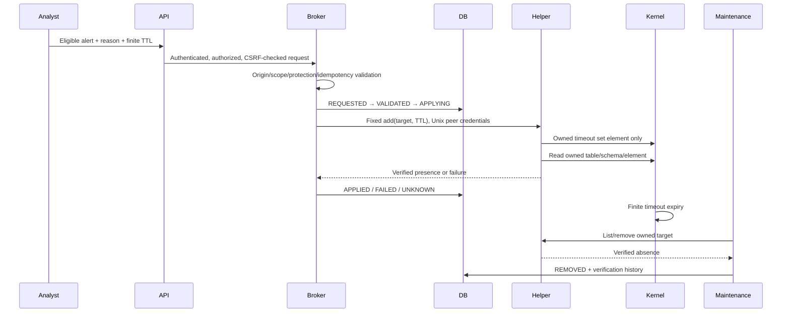

# Manual response and kernel verification

Observe-only and automatic response off are enforced defaults. Live response requires local enablement, allowed CIDRs, eligible trusted capture/service_event alert, no replay/lab run, explicit reason and integer TTL 60–3600s. Replay may record a dry-run decision (VALIDATED/not_enforced); neither add nor removal/reconciliation of lab/replay actions may call the host helper.

States remain separate from alert severity/status/confidence: REQUESTED, VALIDATED, APPLYING, APPLIED, FAILED, UNKNOWN, EXPIRING, REMOVING, REMOVED. Each transition records actor/time/verification; a bounded 500-entry inline history supplements durable audit. Expiry alone is not a verified removal. Kernel absence, or explicit lab namespace destruction for lab actions, must be stated precisely.

The root helper owns only `inet netshield_v2`, marked `NetShield V2 owned response boundary`, timeout sets blocked4/blocked6 (size 1024), and exact input/forward source-address counter/drop rules. It refuses foreign or modified schema/rules, and never flushes, replaces UFW/firewalld, or changes unrelated policy. Fixed subprocess argument arrays and canonical literal IPs replace shell interpolation. SO_PEERCRED admits only the configured unprivileged UID; runtime socket is root-owned and group-restricted. Nonzero nft results/readback failures do not claim success.

Independent root-owned policy restricts allowed/protected networks and automatically protects discovered local IPs, default gateways and resolvers. Protect remote management/jump hosts explicitly. App protections can only further restrict additions. Existing owned targets remain removable after scope changes. Idempotency uses a unique target key and a fail-closed interprocess operation lock. Active actions are capped at 250; retired history is never allowed to hide active reconciliation records.

`reconcile` checks kernel state; `maintenance` checks staleness/expiry, and a service timer repeats it. Startup reconciles when local live response is enabled. Kernel TTL survives web/helper outage. Loss of helper is UNKNOWN, not Applied. Reconciliation is verification/removal only, never automatic new-block policy.

**Portable tests:** authority, protection, concurrency/idempotency, failure/readback contracts and nftables 1.0.x omitted-comment fallback use explicit doubles. **Operator-supplied controlled Linux acceptance:** Ubuntu 22.04.5/Python 3.12.15/nftables 1.0.2, real host manual enforcement, 56 packets/4704 bytes dropped, finite 60s TTL, restored connectivity, REMOVED/kernel_absent reconciliation and Unix peer isolation. [Screenshots, exact provenance and limits](LINUX-ACCEPTANCE.md). These Linux tests were not rerun on the Windows workstation; namespace results remain separate from host-helper acceptance.

On old nftables JSON, only a missing comment triggers fixed table text inspection for the exact table-level marker. Explicit foreign JSON comments, nested/substring text markers and changed owned schema are refused. [Canonical installer](LINUX-INSTALL.md) starts helper only with explicit opt-in/private response scope; automatic response remains false. Its newly generated deployment still needs fresh Linux installer acceptance.
