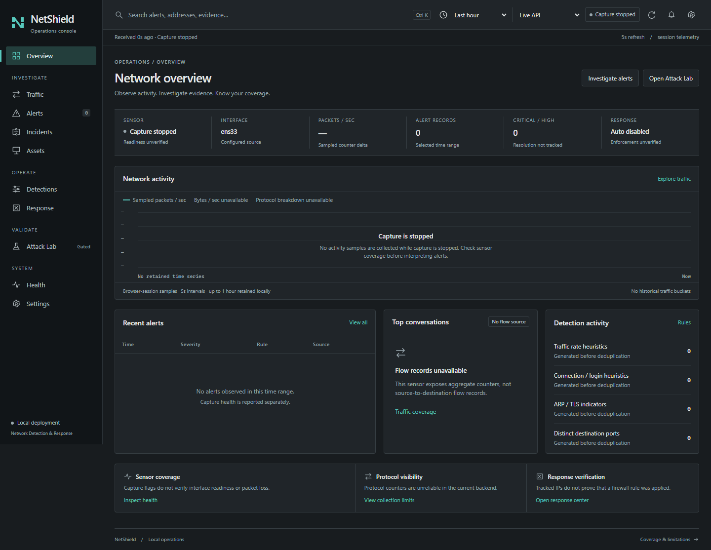
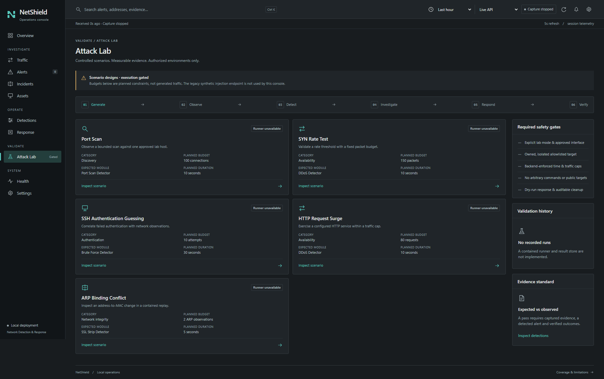
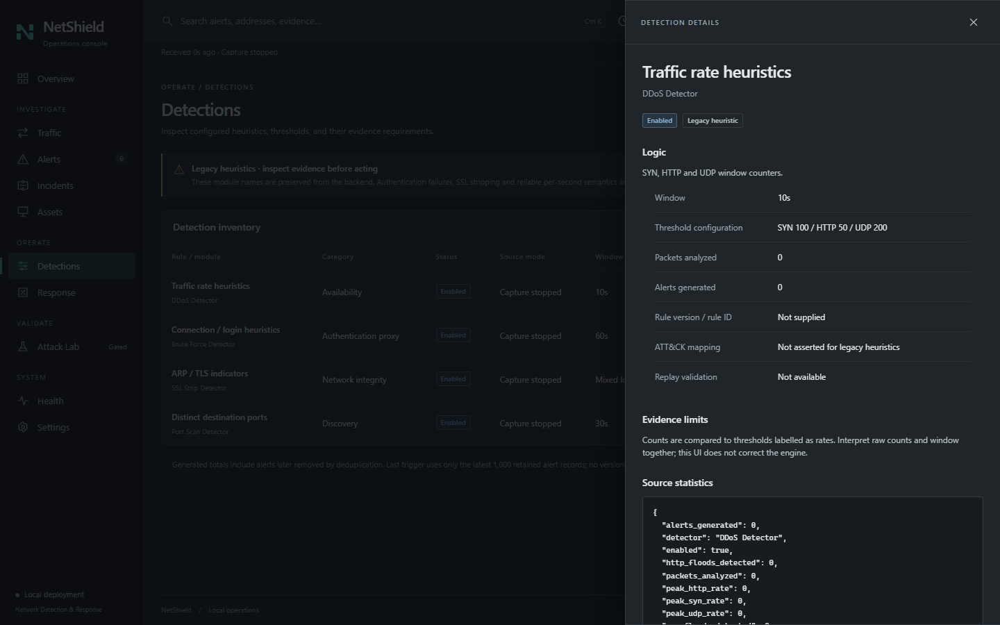
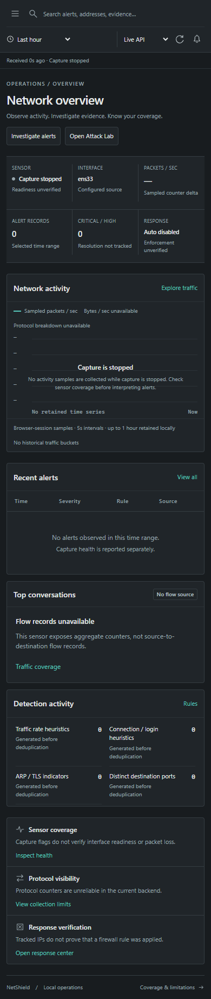
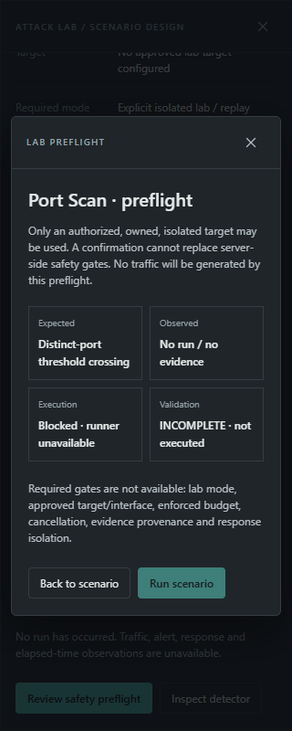
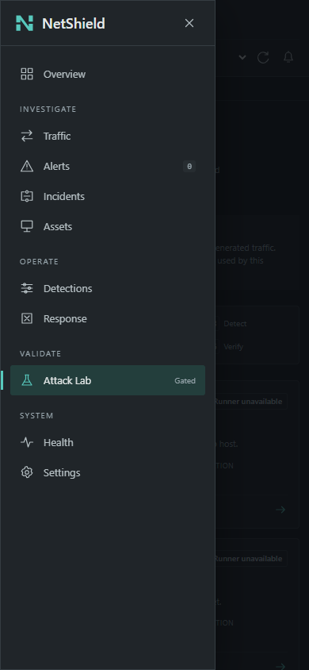

> **Historical phase record.** Phase-specific approval/publication constraints below describe that completed phase. Current public-source status, Apache-2.0 license and verification are recorded in [PUBLICATION](PUBLICATION.md) and the [README](../README.md). Installer Linux lifecycle acceptance remains pending.

# NetShield UI V2 implementation

**Date:** 2026-10-04. **Scope:** solo frontend foundation, completed for review.
No agents or delegates were used. No commit, push, publication, detection-engine
rewrite, real firewall action or attack traffic was performed.

The old dashboard has been replaced with a compact operations console: a
persistent navigation rail, a command bar, an operational status strip, a
wide activity workspace, investigation tables and native detail drawers.
The implementation preserves Flask, SQLite and all legacy engine/API behavior.
Its only production Python change supplies read-only presentation context to
the template.

## 1. What changed

- Replaced the composition, stylesheet and browser controllers instead of
  restyling the old summary cards. Removed the shield/checkmark, emoji icons,
  glow, alarm animation, oversized descriptor and educational-project footer.
- Introduced consistent navigation across ten destinations with hash routes,
  bookmarkable alert query/severity/time-range state and address pivots. The
  shared range persists through sidebar, command-bar and contextual navigation,
  including reloads; search/severity remain explicit investigation filters.
- Built searchable, sortable, paginated alert tables and evidence drawers.
  Severity, lifecycle, confidence and response state are kept distinct.
- Added detector inventory/detail, response records/detail, API/capture health,
  read-only settings and a controlled scenario library with safety preflight.
- Replaced CDN scripts/fonts with local SVGs, native JavaScript modules, native
  dialogs, a small SVG time-series renderer and system font stacks. No frontend
  framework, build pipeline or application dependency was introduced.
- Made request failures, stale data, offline state, stopped capture and missing
  sources explicit. HTTP 401/403 gets an Access denied state distinct from
  transport failure; it does not diagnose operating-system capture permissions.
  Zero alerts never becomes a security verdict.

## 2. Files changed

| File                                          | Purpose                                                                                                             |
| --------------------------------------------- | ------------------------------------------------------------------------------------------------------------------- |
| `dashboard/templates/index.html`              | New application shell, navigation, command controls, dialog containers, safe JSON bootstrap                         |
| `dashboard/static/css/dashboard.css`          | Replacement token system, surfaces, tables, drawers and responsive layouts                                          |
| `dashboard/static/js/dashboard.js`            | Small native-module entry point; replaces legacy polling/simulation controllers                                     |
| `dashboard/static/js/console.mjs`             | Screen rendering, investigation workflows, bounded read polling, URL state and dialogs                              |
| `dashboard/static/js/console-data.mjs`        | Testable filtering, sorting, payload checks and counter-delta sampling                                              |
| `dashboard/app.py`                            | Read-only template context: configured interface, thresholds, response setting, TTL and allowlist count; no secrets |
| `dashboard/static/icons.svg`                  | Original consistent local line-icon sprite                                                                          |
| `dashboard/static/brand/netshield-icon.svg`   | New icon and favicon                                                                                                |
| `dashboard/static/brand/netshield-mono.svg`   | Single-color vector variant                                                                                         |
| `dashboard/static/brand/netshield-lockup.svg` | Horizontal NetShield lockup                                                                                         |
| `tests/ui/serve_console.py`                   | Isolated read-only review server                                                                                    |
| `tests/ui/console-data.test.mjs`              | Presentation-data regression checks                                                                                 |
| `tests/ui/console-browser.cjs`                | Real-browser responsive, state and interaction checks                                                               |
| `tests/ui/README.md`                          | Reproduction instructions and fixture boundaries                                                                    |
| `docs/assets/ui-v2/`                          | Real-state screenshots and capture notes                                                                            |
| `docs/UI-V2-IMPLEMENTATION.md`                | This implementation report                                                                                          |

A SHA-256 comparison against all 49 files present at the start of this phase
found exactly four changed existing files: the template, CSS, original JS entry
and `dashboard/app.py`. The other 45 files, including configuration, engine,
attack scripts, API routes, database, logs and the two V2 planning documents,
were preserved. New files are listed above; no existing file was deleted.

## 3. Design system

The visual direction studies Splunk's compact app navigation, persistent search,
time selection and event-first investigation principles, using an original
NetShield composition and assets. Reference:
[Splunk Enterprise Search app documentation](https://help.splunk.com/en/splunk-enterprise/search/search-manual/9.2/using-the-search-app/about-the-search-app).
No proprietary asset was copied or downloaded.

| Token role                               | Value / behavior                                                               |
| ---------------------------------------- | ------------------------------------------------------------------------------ |
| Background / navigation                  | `#181c1f` / `#111518`                                                          |
| Surface / elevated surface               | `#202529` / `#272d31`                                                          |
| Border / subtle border                   | `#353d42` / `#2b3237`                                                          |
| Primary / secondary / muted text         | `#e5e9e9` / `#b7c1c5` / `#98a6ad`                                              |
| Interaction accent                       | `#57c9bd`; selected navigation, links, primary action, traffic trace           |
| Healthy / warning / danger / information | `#79bf90` / `#e2b365` / `#ed8c88` / `#8ab5db`                                  |
| Spacing scale                            | 4, 8, 12, 16, 20, 24px tokens; compact separators and rows                     |
| Radius                                   | 4px panels/controls, 6px confirmation dialog; square-edge investigation drawer |
| Shadow                                   | Modal depth only; panels use borders and surface contrast                      |
| UI typography                            | Segoe UI, Inter if locally available, Arial, sans-serif                        |
| Technical typography                     | Cascadia Code, SFMono-Regular, Consolas, monospace                             |
| Focus / motion                           | Teal visible focus ring; restrained hover transition; reduced-motion override  |

Typography, color, spacing, radius, shadow and focus tokens live in `:root`.
Color carries a labelled semantic meaning rather than implying that every
cyan/green element is healthy. Green API transport status does not verify capture.

## 4. Logo concept

The **packet-path N** uses two upright network boundaries joined by a diagonal
path, with small horizontal breaks suggesting packets crossing the boundary.
It has no enclosing shield. The 32-unit geometric mark scales directly to
favicon and rail sizes, uses one flat teal fill, and has a monochrome variant.
The horizontal lockup keeps the wordmark secondary to the interface.

## 5. Navigation and implemented screens

| Destination | Implemented experience / source                                                                                                                                                   |
| ----------- | --------------------------------------------------------------------------------------------------------------------------------------------------------------------------------- |
| Overview    | Compact sensor/interface/rate/alert/priority/response strip; sampled activity; recent alerts; detector activity; coverage pivots                                                  |
| Traffic     | Actual capture totals and browser-session rate sampling; clear unavailable flow/byte/protocol/history states                                                                      |
| Alerts      | Latest 1,000 retained API records, 25 rows/page, time/severity filtering, AND text search, timestamp/severity sorting, evidence drawer, source pivot and local JSON record export |
| Incidents   | Purposeful unavailable-state screen and alert-investigation pivot; no fabricated correlation                                                                                      |
| Assets      | Purposeful unavailable inventory state and traffic-coverage pivot; no fabricated hosts                                                                                            |
| Detections  | Four real legacy modules, configured windows/thresholds, enabled status, generated totals and latest retained trigger; detail drawer describes logic/evidence limits              |
| Response    | Tracked IPs, reasons, reported creation/expiry; requested-by/source-alert absent; enforcement **Unknown**, verification **Unverified**; detail drawer                             |
| Attack Lab  | Five scenario designs, planned metadata, workflow stages, detail and preflight; execution gated                                                                                   |
| Health      | Per-resource API state, last receipt/error, engine/capture flags, interface, totals and explicit coverage gaps                                                                    |
| Settings    | Read-only effective configuration and unavailable integrations; no fake user or connected-service badges                                                                          |

The command bar offers alert search, shared time range, **Live API** with
unavailable Replay/Lab options, reported sensor status, refresh and alert/settings
pivots. Live API means polling the current process, not proof of live-packet
provenance. The backend cannot distinguish live and synthetic alert origins.

Queries match rule/type, detector, addresses, reason and raw evidence. Spaces
combine terms with AND; this is not an invented query language. Times are local.
The time range filters loaded alerts and available browser samples. It cannot
retrieve missing backend history; the bounded sample buffer retains up to one
hour and is cleared by browser reload.

Alert export downloads only the selected supplied record to the operator's
computer. It does not upload data or claim sanitization, evidence completeness
or audit-log integrity. Evidence can contain sensitive metadata.

## 6. Attack Lab UX and safety boundary

Scenario library: **Port Scan, SYN Rate Test, SSH Authentication Guessing,
HTTP Request Surge, ARP Binding Conflict**. Each has category, technique,
expected legacy module, planned traffic cap/duration, required isolated mode,
availability and detector limitations. Budgets are design constraints, not
traffic produced by this application.

Selecting a scenario opens a full detail drawer. Reviewing safety preflight
opens a concise modal with **Expected / Observed / Execution / Validation**.
It reports **INCOMPLETE · not executed**, lists missing safety gates and keeps
**Run scenario disabled**. No target/address/command entry or synthetic success
path is exposed.

The workflow is visible: Generate → Observe → Detect → Investigate → Respond
→ Verify. Execution/progress, generated events, detected events, elapsed time,
PASS/FAIL outcomes and result links require a real contained runner and evidence
store. They were not fabricated. The old `/api/simulate` and external attack
scripts remain in the preserved backend but are never invoked by this UI.
Frontend gating is not a backend security boundary; those routes need a separately
authorized hardening phase before deployment.

## 7. Desktop visual QA

Fresh pre-change desktop/mobile screenshots were inspected before editing.
The old 320px page measured 359px wide and displayed stopped capture as LIVE
and zero alerts as SAFE/secure.

The new app was run locally against a safe Flask review server and screenshots
were personally inspected at all five requested widths. Desktop changes after
the first pass tightened the empty chart, reduced detection-row spacing and
separated rule names from legacy module labels. The primary activity panel,
investigation row and coverage strip now have distinct hierarchy.







## 8. Tablet and mobile visual QA

| Viewport  | Result                                                                                                                   |
| --------- | ------------------------------------------------------------------------------------------------------------------------ |
| 1920×1080 | Persistent rail, compact command bar and three-column investigation row; document width 1920px                           |
| 1440×900  | Persistent rail and controlled dense workspace; document width 1440px                                                    |
| 1024×900  | Drawer navigation; two-column investigation row plus compact detector strip; document width 1024px                       |
| 390×844   | Two-row compact command controls, 3×2 status strip, compact detector summary and scenario metadata; document width 390px |
| 320×800   | All page content fits; sensor text wraps deliberately, tables scroll internally; document width 320px                    |

Mobile is a deliberate composition: lower-priority scenario metadata moves into
detail, detector summaries use two columns, and navigation becomes a modal
drawer. Empty-table messages sit outside the wide scroll region so they remain
visible without scrolling; this fixed a defect found during visual QA.
Native dialogs support focus containment, Escape and inert backgrounds. Polling
preserves filters, table scroll/focus and modal openers. The skip link and search
shortcut are keyboard-accessible. Status changes are announced separately from
the continuously updated freshness timestamp.
Sorting and paging preserve horizontal table position and keyboard focus. At a
pagination boundary, focus moves to the remaining enabled pager action.







Screenshots are full-page where useful; vertical scrolling is intentional.
Tables have labelled, keyboard-focusable horizontal scroll regions. This is
Chromium desktop viewport emulation, not a physical-device or full WCAG
certification; Firefox, Safari and assistive-technology testing remain future QA.

## 9. Tests and checks

- **4 Node data tests passed:** compound/time/severity filtering, non-mutating
  sorting, counter sampling/reset/gap behavior and malformed payload rejection.
- **50 real-browser viewport/screen checks passed:** all ten screens at five
  widths; no document overflow and no visible content outside controlled table
  scroll regions.
- Browser interaction checks passed for navigation, nested lab dialogs,
  disabled execution, Escape, Ctrl+K, address pivots, search/severity no-results,
  unsafe telemetry rendered as text, unverified response states, sampled SVG
  chart rendering, API failure and offline handling. The final solo recheck also
  verified shared range navigation/bookmark reloads, 26-record pagination,
  sorting/pager focus and scroll preservation, and explicit HTTP 401/403 states.
- Browser requests were **local GETs only**; no synthetic endpoint, capture
  control, firewall mutation or external CDN/font request was made.
- JavaScript syntax checks and Python AST parsing passed. The existing CLI
  banner's invalid-escape SyntaxWarning remains; it is unrelated to this UI phase.
- Prettier 3.6.2 formatted the touched HTML/CSS/module/test files. It was a
  one-off development tool; no application dependency/package migration occurred.
- SHA-256 preservation check confirmed only the four intended existing files
  changed. Engine, config, API routes, supplied DB/logs and plans retain their hashes.

Browser tests use explicit intercepted fixtures only after real-state screenshot
capture. Fixtures exercise adversarial strings and populated branches; they never
reach the server, become demo data or appear in the screenshot set. Reproduction
instructions are in [tests/ui/README.md](../tests/ui/README.md).

## 10. Backend limitations and remaining risks

| Missing/unreliable backend evidence                                           | Truthful UI behavior                                                                                 |
| ----------------------------------------------------------------------------- | ---------------------------------------------------------------------------------------------------- |
| Historical traffic buckets, bytes, trustworthy protocols                      | No invented time series/donut; browser counter deltas labelled sampled; unavailable metrics explicit |
| Flows / top talkers / assets / correlated incidents                           | Unavailable states and useful investigation pivots                                                   |
| Alert lifecycle, occurrences, confidence, rule IDs/version, provenance        | Untracked / Not reported; raw reason/details exposed; no unsupported ATT&CK assertion                |
| Actual capture readiness, permissions, packet loss, thread heartbeat          | Reported flags and freshness only; unknown coverage remains visible                                  |
| Kernel block verification and durable action history                          | Unknown / Unverified; no Apply/Unblock controls or success badge                                     |
| Safe lab mode, contained targets, enforced budgets, cancellation, run history | Inspect/preflight available; execution unavailable; no fake progress or pass                         |
| Persistent operational evidence, authenticated users, integrations            | Process-local scope disclosed; no invented user/service status                                       |

**The original `AUTO_MITIGATION_ENABLED = True` configuration is unchanged.**
Only the review process disables it. Normal legacy startup, unauthenticated
control routes/socket handlers and their risks remain as described in the audit.
Removing UI mutation controls does not secure those backend interfaces or stop
an already-running engine. This phase does not establish production readiness.

Requests have a seven-second timeout, a single in-flight polling cycle, independent
resource error states, a fifteen-second stale threshold and visibility-aware
polling. Sampling stops across counter resets, capture stop or long gaps. Rates
are approximate receipt-time deltas; they do not repair capture loss/scalability.

## 11. Local review and what comes next

Start the safe preview from the workspace root:

```powershell
python -B tests/ui/serve_console.py
```

Review at <http://127.0.0.1:18482>. It uses a temporary empty store, so the expected
screens show stopped capture and unavailable evidence rather than fabricated
activity. Do not use the legacy normal startup as a substitute for this safe
frontend review harness.

After visual approval, the next separately authorized checkpoint should establish
authenticated/default-off backend controls and durable event/provenance contracts.
Then connect actual flows/traffic buckets, alert lifecycle and a safe replay
runner to these screens; verified response must precede enabling response actions.
Keep future UI changes driven by those contracts instead of adding decorative data.

**Stop:** UI implementation returned for review. No unrelated backend phase,
commit, push or publication has started.


## Final backend integration (2026-10-04)

The preceding report records the approved **frontend-only** milestone, not current backend capability. The final end-to-end implementation replaces its legacy API adapter with authenticated API V2 and durable real parser/rule evidence. See [final completion](NETSHIELD-V2-COMPLETION.md), [scenario walkthroughs](DEMO-SCENARIOS.md) and [API](API.md) for the new authority model.

The graphite/teal tokens, geometric N logo (two packet rails joined across a security boundary), monochrome/lockup SVGs, local SVG icon language and ten-screen native shell remain. Final polish adds compact truthful single-bucket measurements, unconnected chart gaps, UTC timestamps, five-row overview conversations, valid table-cell empty states, three-scenario phone pagination, rule statistics, incident occurrence timelines, typed rule controls, scoped exceptions/protections and real run-progress/result details. No fake chart/host/incident/enforcement data was introduced.

Final viewport evidence: [1920 overview](assets/v2-final/overview-1920.png), [1440 overview](assets/v2-final/overview-1440.png), [1024 alerts](assets/v2-final/alerts-1024.png), [390 lab](assets/v2-final/lab-390.png), [320 settings](assets/v2-final/settings-320.png), [320 alert drawer](assets/v2-final/alert-evidence-320.png). The browser matrix checks all ten screens at all five widths; workflow QA separately exercises keyboard drawers, filters, analyst notes/inert telemetry, manual dry-run removal, incident timeline and authenticated PDF, plus simulated offline/no-results states. Loading/freshness reflect API progress; no “network safe” assertion is used. Actual visual inspection and remaining limits are recorded in the completion report.

Browser PDF clicks may be handled by Internet Download Manager. The operator located the actual report in Downloads/Documents; its copied PDF and both rendered pages were inspected. HTTP/PDF representation is also verified independently in browser QA.
